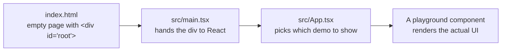
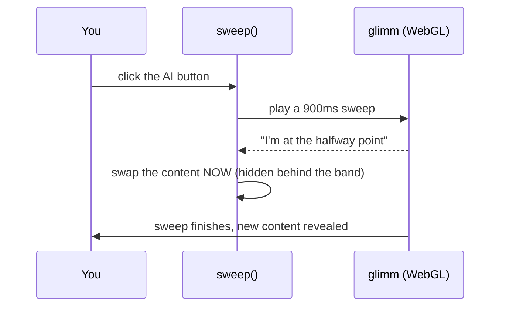

# How This Website Works

A plain-English guide to the Playground app — what it is, what it's built with,
and how every piece fits together. You don't need to be an expert to follow
this; where something technical matters, it gets explained rather than assumed.

---

## Table of contents

1. [What this website is](#1-what-this-website-is)
2. [The tech stack, explained simply](#2-the-tech-stack-explained-simply)
3. [How the app starts up](#3-how-the-app-starts-up)
4. [How pages work (the "router")](#4-how-pages-work-the-router)
5. [The shared shell every page sits in](#5-the-shared-shell-every-page-sits-in)
6. [Page 1 — Article Reader](#6-page-1--article-reader)
7. [Page 2 — Notification Stack](#7-page-2--notification-stack)
8. [Page 3 — Portfolio](#8-page-3--portfolio)
9. [Page 4 — Membership Dashboard](#9-page-4--membership-dashboard)
10. [The chart engine (dither-kit)](#10-the-chart-engine-dither-kit)
11. [The design system: colours, fonts, spacing](#11-the-design-system-colours-fonts-spacing)
12. [How the animations work](#12-how-the-animations-work)
13. [Where the data comes from](#13-where-the-data-comes-from)
14. [Responsiveness and accessibility](#14-responsiveness-and-accessibility)
15. [Running and building the project](#15-running-and-building-the-project)
16. [Full file map](#16-full-file-map)
17. [How to add a new page](#17-how-to-add-a-new-page)

---

## 1. What this website is

This is a **front-end playground**: a single website that holds four separate,
polished UI demos. Each demo is a faithful build of a Figma design, and most of
them are displayed inside a **laptop/phone mockup** — a fake device bezel drawn
in CSS — so the demo looks like a screenshot of a real product.

You move between the four demos using a small floating pager at the bottom of
the screen.

The four demos are:

| Demo | What it shows |
|---|---|
| **Article Reader** | A long-form article page with an outline sidebar, a "Listen" button, and an AI-summary view |
| **Notification Stack** | A stack of iOS-style notification cards that fan out and can be swiped away |
| **Portfolio** | A finance dashboard with an animated chart, currency switching, and a drill-down insights view |
| **Membership Dashboard** | A full SaaS admin screen — sidebar, sortable/filterable member table, pagination |

**Important thing to understand up front: there is no server and no database.**
Everything you see is produced in the browser from data files that ship with the
site. No login, no API calls, no backend. That makes it a *design and
interaction* showcase rather than a working product.

---

## 2. The tech stack, explained simply

Think of the stack in four layers: the language, the UI framework, the styling,
and the motion.

### The build tool — **Vite**

Vite is the thing that turns the source code into a website. Two jobs:

- **In development** (`npm run dev`), it serves the site instantly and updates
  the browser the moment you save a file — no manual refresh.
- **For production** (`npm run build`), it bundles everything into a small
  folder of optimised files (`dist/`) that can be uploaded to any static host.

Vite also handles the `@/` shortcut, so `@/components/Button` means
`src/components/Button` no matter how deep the file importing it lives.

### The language — **TypeScript**

TypeScript is JavaScript with labels on the data. Instead of hoping a value is a
number, you say so, and the editor warns you before you ever run the code.

You see this all over the project as small "shape" definitions:

```ts
type Point = { date: string; value: number }
```

That single line means: *every chart point must have a text date and a numeric
value.* If someone typo's `valu`, the build fails instead of the chart silently
breaking.

### The UI framework — **React 19**

React is what actually draws the interface. Its core idea:

> The screen is a **function of state**. Change the state, and React redraws the
> parts of the screen that depend on it.

"State" is just remembered values — which page you're on, which currency is
selected, which rows are ticked. In code it looks like this:

```tsx
const [range, setRange] = useState<Range>('3M')
```

That reads as: *remember a value called `range`, start it at `'3M'`, and give me
`setRange` to change it.* When you click the "1Y" tab, `setRange('1Y')` runs,
React notices the value changed, and redraws the chart with a year of data. You
never write "go find the chart and update it" — you change the value and React
works out the rest.

Interfaces are built from **components**: small reusable functions that return a
piece of screen. `<ListenButton />` is a component. So is an entire page. Bigger
components are made by nesting smaller ones, which is why this project has ~40
component files instead of four giant ones.

### The styling — **Tailwind CSS v4**

Instead of writing separate stylesheets, styling is done with short class names
directly on the element:

```tsx
<div className="flex items-center gap-2 rounded-full bg-white px-4">
```

That's: lay children out in a row, centre them vertically, put 8px between them,
round the corners fully, white background, 16px of side padding. The advantage
is that you can see exactly how something looks without hunting through CSS
files, and unused styles never accumulate.

The project defines its own vocabulary on top of Tailwind in
[`src/index.css`](src/index.css) — things like `text-ink` (the project's black),
`border-hairline` (the pale grey border) and `shadow-panel`. More on that in
[section 11](#11-the-design-system-colours-fonts-spacing).

### The motion — **Framer Motion**

The library behind almost every animation. Its trick is that you keep writing
normal markup — you just swap `<div>` for `<motion.div>` and describe *states*
rather than steps:

```tsx
<motion.div
  initial={{ opacity: 0, y: 6 }}   // how it starts
  animate={{ opacity: 1, y: 0 }}   // where it ends up
/>
```

Framer Motion works out the frames in between. It also handles the harder cases
this project leans on: animating things as they're *removed* from the page
(`AnimatePresence`), dragging with real momentum, and physics-based springs
instead of fixed-duration easing.

### Supporting pieces

| Package | What it does here |
|---|---|
| **glimm** | A small WebGL library that draws the colourful "sweep" wipe when a page transitions. WebGL means the graphics card draws it, so it stays smooth. |
| **dither-kit** | The charting toolkit (area chart, pie chart). Its source lives *inside* this project at `src/components/dither-kit/` — see [section 10](#10-the-chart-engine-dither-kit). |
| **d3-scale / d3-shape** | Pure maths helpers used by dither-kit: "given a value of 52,487 and a box 300px tall, how far up should the point sit?" No drawing, just numbers. |
| **clsx + tailwind-merge** | Combine class names safely. If two conflicting classes end up on one element, `tailwind-merge` keeps the last one instead of leaving both to fight. |
| **@fontsource-variable/geist**, **svg-country-flags** | Bundled font and flag assets, so the site never depends on an external CDN. |
| **oxlint** | A very fast linter that flags likely mistakes before they ship. |
| **shadcn / Base UI / class-variance-authority** | Installed as part of the dither-kit setup. Only `src/components/ui/button.tsx` uses them, and no page currently imports it — treat it as scaffolding, not active code. |

---

## 3. How the app starts up

Four small steps, in order:



1. **[`index.html`](index.html)** — a nearly empty HTML page. It contains one
   empty `<div id="root">` and a script tag pointing at `main.tsx`. Everything
   you see is created after this point by JavaScript.

2. **[`src/main.tsx`](src/main.tsx)** — 10 lines. It finds that empty div, loads
   the global stylesheet, and tells React to render `<App />` inside it.
   `StrictMode` is a development-only wrapper that double-checks for common
   React mistakes.

3. **[`src/App.tsx`](src/App.tsx)** — the top-level component. It asks
   `usePlayground()` which demo should be showing, wraps everything in
   `SweepProvider` (the transition effect), renders that demo, and puts the
   pager at the bottom.

4. **The playground component** — one of the four demos, which then renders the
   dozens of smaller components that make up its screen.

One detail in `App.tsx` worth calling out:

```tsx
<Component key={active.id} />
```

The `key` tells React "this is a *different* component when the id changes."
Without it React would reuse the old one and quietly keep its state; with it,
every demo gets a clean start and replays its entrance animation each time you
switch to it.

---

## 4. How pages work (the "router")

Most React sites use a routing library. This one doesn't need to — it has four
pages, so it uses about 35 lines instead.

### The registry — the list of pages

[`src/playgrounds/registry.ts`](src/playgrounds/registry.ts) is a plain array:

```ts
export const playgrounds = [
  { id: 'article-reader',       label: 'Article Reader', Component: ArticleReader },
  { id: 'notification-stack',   label: 'Notifications',  Component: NotificationStack },
  { id: 'portfolio',            label: 'Portfolio',      Component: Portfolio },
  { id: 'membership-dashboard', label: 'Membership',     Component: MembershipDashboard },
]
```

Each entry has three things: an `id` (used in the URL), a `label` (shown in the
pager), and the `Component` itself. **This array is the single source of truth**
— the pager, the URL handling and the page order all read from it, so adding a
page here is genuinely all it takes.

### The hook — which page is active

[`src/playgrounds/usePlayground.ts`](src/playgrounds/usePlayground.ts) keeps the
active page **in the URL hash** — the bit after `#`:

```
yoursite.com/#/portfolio
```

Storing it there buys three things for free:

- The URL is **shareable** — send someone a link to a specific demo.
- It **survives reload** — refreshing keeps you on the same demo.
- The browser **back button works**, because changing a hash adds a history
  entry.

The hook listens for the browser's `hashchange` event, checks the id against the
registry, and falls back to the first page if the hash is missing or nonsense
(so `#/banana` shows the Article Reader rather than a blank screen). It also
updates the browser tab title to match, e.g. `Portfolio · Playground`.

### The pager — switching pages

[`PlaygroundSwitcher.tsx`](src/components/PlaygroundSwitcher.tsx) is the floating
pill at the bottom: `‹  Article Reader  ›`.

- Arrows step through the registry and **wrap around** — next from the last page
  returns to the first.
- Left/Right arrow keys do the same thing.
- The label slides out and the new one slides in, **in the direction you
  travelled** — the component remembers whether you pressed next or previous and
  animates accordingly.
- The label sits in a fixed 168px-wide box, so the pill doesn't visibly resize
  as names of different lengths swap through.
- It's `position: fixed` and floats *over* the bottom of the device mockup,
  because the mockup deliberately runs off the bottom of the screen — reserving
  a row for the pager would cut the screen short.

---

## 5. The shared shell every page sits in

### `DeviceFrame` — the laptop mockup

[`DeviceFrame.tsx`](src/components/DeviceFrame.tsx) draws the device the demos
appear inside. It is entirely CSS — no image:

```
┌────────────────────────────────────┐  ← outer bezel (1.5px border, 45px radius)
│ ┌────────────────────────────────┐ │  ← 7px gap
│ │       ▂▂▂▂▂ notch              │ │  ← inner screen (white, clipped)
│ │                                │ │
│ │        page content            │ │
│ │                                │ │
```

Three details that matter:

- **No bottom border.** The frame is `border-b-0` and runs off the bottom of the
  viewport, which is what makes it read as a laptop propped up rather than a
  floating rectangle.
- **The screen clips its contents** (`overflow: hidden` plus the corner radius).
  This is what keeps the WebGL sweep and the Portfolio sheet from spilling past
  the "glass".
- **Its height is explicit** (`h-svh`, i.e. exactly one screen tall) rather than
  "whatever's left". That sounds pedantic, but a scrollable area can only scroll
  if every parent above it has a *definite* height — a common source of "why
  won't this scroll" bugs. Below 560px tall it stops shrinking and the whole page
  scrolls instead, so the content never squeezes to nothing.

Three of the four demos use `DeviceFrame`. **Membership Dashboard deliberately
doesn't** — it's a full-screen admin app, so it fills the browser window
directly.

### `SweepProvider` — the transition effect

When you tap the AI button in the Article Reader, or "Portfolio Insight" in the
Portfolio, a coloured band sweeps across the screen and the content is different
on the other side. That's [`sweep.tsx`](src/components/sweep.tsx), powered by
glimm.

How it works, conceptually:



The swap happens at the band's midpoint, so you never see the change — the band
is covering it. That's the whole illusion.

Two engineering notes worth knowing:

- glimm normally covers the **entire browser window**. Here the canvas is
  injected into a host element *inside* the device screen, so the sweep is
  clipped to the mockup — it looks like the laptop's screen is transitioning,
  not your browser.
- If WebGL is unavailable, or the viewer has "reduce motion" turned on in their
  OS, the sweep is skipped and the content simply swaps. **Nothing breaks.**

`SweepProvider` sits above the page in `App.tsx` and shares the `sweep()`
function through React **context** — a way to make something available to any
component beneath it without passing it down by hand at every level.

---

## 6. Page 1 — Article Reader

A three-column reading experience. Source:
[`src/playgrounds/ArticleReader.tsx`](src/playgrounds/ArticleReader.tsx).

```
┌─────────────┬───────────────────────────┬─────────────┐
│  outline    │ ▨▨▨ hatch band ▨▨▨        │             │
│  minimap    │                           │             │
│  ▬▬▬▬       │  The Historical Age of    │             │
│  ▬▬▬▬▬      │  AI and Human Collab...   │             │
│  ▬▬▬        │                           │             │
│  ▬▬▬        │  ▶ Listen  Share  Options │             │
│             │                           │             │
│             │  Body text scrolls here…  │      (⚡)    │
│  ✎ 3 days   │  ░░░ blur fade ░░░        │   Ask AI    │
└─────────────┴───────────────────────────┴─────────────┘
```

### Its pieces

**`OutlineMinimap`** (left rail) — the little stack of grey dashes. It's an
abstract map of the article: each section owns a run of lines, and the lines for
the section you're currently reading turn dark. Two nice touches:

- **Magnification.** As your cursor moves down the rail, lines reach further to
  the right the closer they are to the pointer, falling off on a bell curve. The
  heights and spacing never change, so the outline never reflows — the effect
  runs sideways only.
- Clicking a section smooth-scrolls the article to it.

**`useActiveSection`** — the hook that decides which section is "current". It
listens to the reading pane's scroll and picks the last section whose top has
passed an imaginary line 35% down the pane. That 35% is deliberate: using the
very top would flip the highlight a beat too early.

**`HatchBand`** — the diagonal-striped strip above the article. When "Listen" is
active, a soft gradient sweeps across it on a loop, like a progress shimmer.

**`ArticleBody`** — renders the article from data rather than hard-coded markup.
[`src/content/article.ts`](src/content/article.ts) describes the article as a list
of typed blocks:

```ts
{ kind: 'p',     text: '…' }              // paragraph
{ kind: 'h2',    text: '…' }              // heading
{ kind: 'quote', text: '…' }              // pull quote
{ kind: 'list',  intro: '…', items: […] } // bulleted list
```

`ArticleBody` walks that list and renders the right element for each `kind`.
Change the content file and the article changes — no layout code touched.

**`ListenButton`** — toggles between "Listen"/play and "Playing"/pause. Both
icons and both labels are always in the DOM, stacked on top of each other in the
same grid cell; one fades and rotates out as the other fades in. That's why the
button doesn't twitch or resize when you press it. *It doesn't play real audio —
it's a presentational demo.*

**`AskAiFab`** — the round gradient button. Its background is a four-colour
gradient slowly drifting on a 9-second loop, it shows a tooltip on hover, and
clicking it triggers the sweep transition to the AI summary view.

**`ProgressiveBlur`** — the fade at the bottom of the reading pane. This is more
interesting than it looks. A single `backdrop-blur` gives a hard edge where the
blur starts. This component instead stacks **ten** thin blur layers with
gradient masks, each one calculated so the *cumulative* blur ramps smoothly from
0 to ~4.9px — matching the exact curve Figma specified. (Stacked blurs compound
in quadrature, not linearly, which is why the maths in that file looks like it
does.)

### What happens when you click "Ask AI"

1. `toggleView()` calls `sweep()`, which starts the WebGL band.
2. At the midpoint, the callback runs: `view` flips from `'article'` to
   `'summary'`, and the pane scrolls back to the top.
3. React swaps `<ArticleBody />` for `<AiSummary />`.
4. The band finishes and reveals the summary.

Clicking again sweeps back **in the opposite direction** (`rtl` instead of
`ltr`), so the motion reads as returning rather than advancing.

---

## 7. Page 2 — Notification Stack

The smallest demo, and a good one for understanding Framer Motion. Source:
[`src/playgrounds/NotificationStack.tsx`](src/playgrounds/NotificationStack.tsx).

**What you see:** three notification cards stacked like a deck. Hover (or tap on
touch) and they fan out into a readable list. Drag one sideways and it flies
away.

**How the stack geometry works.** Every card is `position: absolute` and pinned
to the bottom of the container. Their appearance is pure arithmetic off their
index in the list:

| | Collapsed | Expanded |
|---|---|---|
| Vertical offset | `-i × 12px` | `-i × 86px` (full card height + gap) |
| Scale | `1 - i × 0.05` | `1` |
| Opacity | `1 - i × 0.15` | `1` |

So card 0 is full size and fully opaque; each card behind is slightly smaller,
slightly higher and slightly faded — which is exactly what reads as depth. Switch
one set of numbers for the other and Framer Motion springs between them.

**Swipe to dismiss.** Cards are `drag="x"` with constraints pinned to zero, so a
card always springs back unless you commit. On release the code checks two
things:

```ts
if (Math.abs(info.offset.x) > 90 || Math.abs(info.velocity.x) > 500) dismiss(...)
```

Either **far enough** (90px) *or* **fast enough** (a flick). Checking velocity as
well as distance is what makes a quick flick work — without it, short fast
swipes feel broken.

**Removal animation.** `AnimatePresence` is what lets a dismissed card fade and
shrink on its way out. Normally React deletes an element instantly; this wrapper
keeps it alive just long enough to finish its exit animation.

The buttons below add a new card to the front of the list or clear them all; when
the list is empty an "All caught up" placeholder fades in.

---

## 8. Page 3 — Portfolio

The most technically involved demo, and it's really *two* screens.
Source: [`src/playgrounds/Portfolio.tsx`](src/playgrounds/Portfolio.tsx) and
[`PortfolioInsights.tsx`](src/components/PortfolioInsights.tsx).

### View A — Performance

```
┌──────────────────────────────────────────────┐
│ Portfolio Performance        🇺🇸 US Dollar ▾ │
│ [15%] down from last month.                  │
│ $52,487.00                    1M 3M 6M 1Y    │
│                                              │
│        ╱╲      ╱╲                            │  ← dithered area chart
│   ╱╲__╱  ╲___╱   ╲___                        │
│  Aug 12      Sep 9      Oct 7                │
│                                              │
│  ┌────────────────────────────────────┐      │
│  │ Your portfolio is valued at…       │      │  ← insight panel
│  │ ░░░ text fades under blur ░░░      │      │
│  └───────────[ ✦ Portfolio Insight ]──┘      │  ← the "key" button
└──────────────────────────────────────────────┘
```

**Range tabs (1M / 3M / 6M / 1Y)** slice a fixed 53-week series to the last
5/14/27/53 points and the chart redraws. The data isn't random — it's a fixed
array shaped to match the curve in the original Figma design, with older weeks
generated from a sum of sine waves. Deterministic, so it looks identical on every
reload.

**Scrubbing the chart** is the standout interaction. Move your cursor across the
plot and:

- the big number rolls to that week's value,
- the "15% down from last month" line is replaced by that point's full date,
- the fill goes grey *past* your cursor, so the coloured part reads as "up to
  here".

That grey boundary is a **real spring simulation** — the code integrates a
damped harmonic oscillator (`F = −kx − cv`) inside the canvas's own animation
loop, at a fixed 4ms substep so it behaves identically on a 60Hz and a 120Hz
screen. Locking the boundary rigidly to the cursor felt lifeless; giving the
block of colour a little inertia is what makes it feel physical. The crosshair
itself still tracks the pointer exactly — only the colour lags.

**`RollingNumber`** is the odometer behind the figure. Each digit is its own
clipped window with a 0–9 strip springing behind it, staggered so the ones place
leads. Three problems it solves that are invisible when done right:

- **Digit widths.** `tabular-nums` makes a `1` occupy the same width as a `0`, so
  the number doesn't jitter as digits change.
- **Keying from the right.** When the value crosses a digit count ($9,900 →
  $10,100), numbering columns from the left would renumber every column and roll
  digits that never changed. Numbering from the right keeps them still.
- **Kerning.** Splitting text into per-character boxes loses the spacing the
  font would apply between glyph pairs. The component *measures* the real string
  against the sum of its boxed characters and spreads the difference back across
  the boxes — landing within 0.05px of the same text set normally.

There's also a nice free effect: each digit's motion blur is derived from its
own **velocity**, so a one-step tick barely blurs while a 9→0 rewind smears and
lands crisp.

**Currency switching** (`CurrencySelect`) multiplies the amount by a fixed rate
per currency and swaps the symbol. The rates in
[`src/lib/currencies.ts`](src/lib/currencies.ts) are **fixed reference numbers,
not live FX.**

**The "Portfolio Insight" key** is animated like a physical keycap. Hovering
takes a third of the throw; pressing takes the rest. The trick is that the cap's
downward offset and the shadow "lip" height always sum to 3px, so the key's
*bottom edge never moves* — only the cap travels down onto its base. Animating
position alone would look like the button sliding rather than being pressed.

Clicking it sweeps **bottom-to-top** into:

### View B — Insights

A drill-down showing five holdings (NVDA, AAPL, MSFT, AMZN, TSLA):

- A **pie chart** or a single **allocation bar** — a tab toggle switches between
  them. Both are painted with the same dither material, so switching changes the
  *shape*, not the visual language.
- Hovering a slice or segment shows a card with that holding's value and a
  written insight, **and** highlights the matching row in the table below with
  animated diagonal stripes in that holding's colour.
- A **holdings table** with price, shares, allocation %, change and market value.
- A **month picker** that regenerates the numbers.

The numbers are generated by [`src/lib/holdings.ts`](src/lib/holdings.ts) using a
**seeded pseudo-random generator** (`mulberry32`). This is a deliberate design:
a random seed is picked once when the view mounts, so the portfolio looks
different on each visit — but because the generator is deterministic, revisiting
a month you've already viewed *this session* reproduces exactly the same numbers.
Randomised, but not unstable.

Both views share the same `PortfolioSheet` shell — same size, radius, shadow and
padding — specifically so the swap underneath the sweep never moves or resizes
the card.

---

## 9. Page 4 — Membership Dashboard

A full admin screen, and the only demo that skips the device mockup. Source:
[`src/playgrounds/MembershipDashboard.tsx`](src/playgrounds/MembershipDashboard.tsx).

```
┌──────────────┬────────────────────────────────────────┐
│ ⛵ Sailor Pro │ Membership              3 selected     │
│ [Acmenola ▾] ├────────────────────────────────────────┤
│              │ ☑ Name    Email    Tier▾  Company▾ Date│
│ ▸ Dashboard  │ ☐ 👤 Elena  e@…   [Pro]  Apple  12 Jan │
│ ▸ Explore    │ ☑ 👤 John   j@…   [Ent]  Google 03 Feb │
│ ▸ Membership │ ☐ 👤 Sara   s@…   [Bas]  Tesla  27 Feb │
│ ▸ Analytics  ├────────────────────────────────────────┤
│ ▸ Settings   │ Showing 1–15 of 40   Rows ▾  Page 1/3  │
└──────────────┴────────────────────────────────────────┘
```

### What it does

**Workspace switching re-themes the sidebar.** Each workspace has an accent
colour and a deep background tone. Pick a different one and the sidebar
background crossfades over 400ms. The logo tile's colour isn't hard-coded — it's
*derived* from the background by [`src/lib/color.ts`](src/lib/color.ts), which
converts the hex to HSL, adds lightness points, and converts back. Adding a new
workspace means adding two colours, not five.

**The nav highlight slides.** The glow behind the active nav row uses Framer
Motion's `layoutId` — when two elements in different places share a `layoutId`,
Framer animates the element *between* the positions rather than removing one and
adding another. That's why the glow slides down the menu instead of blinking.

**The table** is a real, working data grid over 40 sample members:

| Feature | How it works |
|---|---|
| **Sorting** | Click a column header to sort; click again to reverse. Tier sorts by its label, not its internal id. |
| **Filtering** | Tier and Company headers open a checkbox menu. Multiple selections are OR'd; a dot appears on the header when a filter is live. |
| **Pagination** | Choose 10/15/25/50 rows. Any sort or filter change resets you to page 1 — otherwise you can end up stranded on a page that no longer exists. |
| **Selection** | Checkboxes per row plus select-all-on-page; the count appears in the header. Selections are stored in a `Set`, so checking is instant regardless of list size. |

The data pipeline is a clean chain of memoised steps, each only recalculating
when its own inputs change:

```
MEMBERS → filter (tier, company) → sort (key, direction) → slice (page) → render
```

**Sizing uses container queries.** Note the `@container` class on the root and
units like `clamp(11px, 1.3cqw, 13px)`. `cqw` means "1% of the *container's*
width", not the viewport's. So the whole dashboard scales proportionally to the
space it's given rather than to the browser window — every font size, column
width and padding value has a floor, a fluid middle and a ceiling.

---

## 10. The chart engine (dither-kit)

The charts have a distinctive look: instead of a smooth gradient fill, the area
under the curve is filled with a **dither** — a pattern of small coloured cells,
like an old 8-bit game or a printed halftone.

### Where it lives

`src/components/dither-kit/` (~30 files). It was installed with a CLI that
**copies the source into the project** rather than adding a dependency — the
same model shadcn uses. The upside: these are *our* files and can be edited. The
tradeoff: updates aren't automatic. [`dither-kit.json`](dither-kit.json) records
which version was copied in and the checksums of each file.

### How it draws

Unlike most React charts, this doesn't produce SVG elements. It uses a
**`<canvas>`** and paints pixels in a `requestAnimationFrame` loop:

1. **Measure** the container.
2. **Scale** the data into pixel positions (this is what d3-scale does).
3. **Resample** the curve into columns two pixels wide.
4. **Ease** each column from its current height toward its target — which is
   what produces the draw-on animation and the smooth morph when you change
   range.
5. **Dither** each column: for every cell, compare its brightness against a 4×4
   Bayer matrix threshold to decide whether the cell is "on" or "off". Rather
   than leaving holes, off cells use a dimmer tier of the *same* colour, which is
   why the fill reads well on both light and dark backgrounds.
6. **Layer on** the crosshair, the top outline and the occasional "star" sparkle.

A canvas is the right tool here: painting thousands of small cells as individual
SVG elements would bring the browser to a crawl.

### The one big performance rule

> **Keep the `data` array referentially stable.**

The chart replays its entrance animation whenever the *identity* of `data`
changes. If you wrote `data={SERIES.slice(-14)}` inline, that would create a
brand-new array on every render — and since scrubbing re-renders on every mouse
move, the curve would visibly restart its animation under your cursor. Hence:

```tsx
const data = useMemo(() => SERIES.slice(-RANGES[range]), [range])
```

`useMemo` says "only rebuild this when `range` changes." Scrubbing then moves
nothing but the crosshair. Same reason `CHART_MARGINS` is defined at the top of
the file rather than inline.

### Local modifications

Three small changes were made to the vendored files to support the scrub effect
— which is precisely the point of copy-in vendoring:

- A `mute` colour (`#BEBEBE`) added to the palette, kept separate from `grey`
  (which means "no data" rather than "not the subject").
- `paintColumn` gained an optional `bodySeed`, so the fill can be recoloured
  without recolouring the trend line that traces it.
- The canvas resolves where the split falls and folds the cursor position into
  its repaint signature — without that, the crosshair would move while the
  colours stayed put.

---

## 11. The design system: colours, fonts, spacing

Everything lives in [`src/index.css`](src/index.css) under Tailwind v4's
`@theme` block. Define a variable there and Tailwind generates matching
utilities automatically — `--color-ink` gives you `text-ink`, `bg-ink`,
`border-ink`.

### Colours

```css
--color-ink: #000000;        /* primary text */
--color-muted: #8d8d8d;      /* secondary text */
--color-outline: #555555;    /* borders + tertiary text */
--color-hairline: #eaeaea;   /* the pale dividing line everywhere */
```

Plus scoped sets for the Portfolio (`--color-stat`, `--color-loss`,
`--color-insight`…) and the article tags. Using `text-ink` instead of
`text-black` means one edit changes the whole site.

### Fonts

Five typefaces, each with a job:

| Variable | Font | Used for |
|---|---|---|
| `--font-display` | Exposure Italic | Headlines in the Article Reader |
| `--font-body` | Pretendard Std | Article body text |
| `--font-figure` | Open Runde | The entire Portfolio sheet |
| — | Inter Display | The Membership Dashboard |
| `--font-sans` | Geist Variable | Default fallback (from the shadcn setup) |

All are loaded from `src/assets/fonts/` with `font-display: swap`, meaning text
appears immediately in a fallback font and re-renders when the real one arrives —
you never stare at invisible text.

### Fluid spacing

This is one of the more thoughtful parts of the CSS:

```css
--spacing-frame-top:  clamp(16px, 5vh,    40px);  /* Figma says 40 */
--spacing-read-top:   clamp(16px, 6vh,    48px);  /* Figma says 48 */
--spacing-frame-floor: 560px;
```

`clamp(min, preferred, max)` means: use the middle value, but never below the
first or above the last. So on a normal screen you get the exact Figma spacing,
and on a short screen (a small laptop, or a user at 200% browser zoom) the
padding shrinks *first* — protecting the reading area, which would otherwise
absorb the entire loss. At 200% zoom this is the difference between ~116px of
readable text and none at all.

### Custom utilities

- `.scroll-hidden` — hides the scrollbar (a native one would cut across the
  device bezel) while keeping the area scrollable.
- `.trim-cap` — uses the modern `text-box: trim-both cap alphabetic` property so
  a label centres on its *letterforms* rather than its line box, matching how
  Figma measures text.
- `.shadow-raised`, `.shadow-fab`, `.shadow-panel` — layered shadows. Each is
  four to six barely-visible shadows stacked, because real light falls off
  gradually; a single big blur reads as fake.
- `.row-hatch` — the animated diagonal stripes on a highlighted table row.

---

## 12. How the animations work

### Everything comes from one file

[`src/lib/motion.ts`](src/lib/motion.ts) holds every timing and easing value used
in JavaScript, mirroring the CSS custom properties so the two halves can't drift
apart:

```ts
export const duration = { fast: 0.15, normal: 0.2, slow: 0.28 }

export const springResponsive = { type: 'spring', stiffness: 400, damping: 30, mass: 0.8 }
export const springOvershoot  = { type: 'spring', stiffness: 300, damping: 15, mass: 0.6 }

export const pressable = { whileTap: { scale: 0.98 } }
```

The distinction between the two springs is the useful part:

- **`springResponsive`** — settles cleanly with almost no bounce. Sliders,
  handles, counters, things moving between containers.
- **`springOvershoot`** — overshoots slightly before settling. Badges, pops, the
  front card of the notification stack.

`pressable` uses `scale: 0.98`, not `0.9` — a firm press, not a collapse.

### The house entrance

Every element that appears on screen uses the same entrance, defined in
[`src/components/rise.ts`](src/components/rise.ts):

> **fade in + rise 6px + a 2px blur that clears** — never a plain fade.

The blur is what makes it feel like the element is settling into focus rather
than just becoming visible. Elements stagger in with explicit per-block delays
(0.05s, 0.12s, 0.18s…) rather than Framer's variant system, so a nested
interaction animation is never accidentally driven by its parent's entrance.

### Reduced motion is respected everywhere

If the viewer has "reduce motion" enabled in their operating system:

- `useRise()` returns no animation at all,
- notification cards can't be dragged,
- the odometer jumps to its value instead of rolling,
- the WebGL sweep is skipped and content simply swaps,
- and a global CSS rule cuts every remaining transition to 0.01ms.

This isn't decoration — for people with vestibular disorders, large sweeping
motion can cause genuine nausea.

---

## 13. Where the data comes from

Nowhere external. Every number and every word ships with the site:

| File | Contains |
|---|---|
| [`src/content/article.ts`](src/content/article.ts) | The article: title, byline, tags, every paragraph, and the AI summary |
| [`src/lib/holdings.ts`](src/lib/holdings.ts) | The five stocks plus the seeded generator that varies their prices |
| [`src/lib/members.ts`](src/lib/members.ts) | 40 sample members, four tiers, seven company logos |
| [`src/lib/currencies.ts`](src/lib/currencies.ts) | Five currencies with fixed reference rates |
| [`src/lib/months.ts`](src/lib/months.ts) | The month picker's options |
| Inside `Portfolio.tsx` | The 53-week chart series |

What this means in practice:

- The site works **offline** once loaded.
- It can be hosted anywhere that serves static files — no server, no runtime
  cost.
- Editing content means editing a data file, not hunting through markup.
- And, to be clear: **the AI summary is pre-written text, not a live model
  call**, the Listen button plays no audio, and the currency rates are not real.

---

## 14. Responsiveness and accessibility

### Responsive behaviour

The project uses three different sizing strategies, each where it fits best:

1. **Breakpoints** (`sm:`, `md:`, `lg:`) for structural changes. Below `lg` the
   Article Reader's two side rails disappear and the Ask-AI button floats over
   the content instead.
2. **Fluid clamps** (`clamp(min, vh, max)`) for vertical spacing, so short
   screens lose padding before they lose content.
3. **Container queries** (`cqw`) in the Membership Dashboard, so it scales to its
   own box rather than the window.

The device notch even adapts: a Dynamic Island-style pill on mobile widths, a
wider webcam bar on desktop.

### Accessibility

Real effort has gone in here:

- **Semantic HTML** — `<article>`, `<aside>`, `<nav>`, `<table>` with proper
  `<th scope="col">`. Screen readers get real structure, not a soup of divs.
- **ARIA where the semantics run out** — `role="tablist"` on the range tabs,
  `role="listbox"` on the dropdowns, `aria-live="polite"` on the pager label so
  changes are announced, `aria-pressed` on the Listen toggle.
- **Keyboard support** — arrow keys drive the pager, `Escape` closes dropdowns,
  and interactive elements have `focus-visible` rings (which appear for keyboard
  users but not on mouse click).
- **Decorative content is hidden** — the hatch band, the minimap strokes and the
  sweep canvas all carry `aria-hidden="true"`, so screen readers skip noise.
- **The odometer announces plainly** — the rolling digits are hidden from
  assistive tech and the component exposes a simple `aria-label="$52,487.00"`
  instead.
- **Reduced motion**, as covered above.

---

## 15. Running and building the project

```bash
npm install
```

```bash
npm run dev
```

Starts the dev server (usually <http://localhost:5173>) with instant reload.

```bash
npm run build
```

Type-checks the whole project, then bundles it into `dist/`. If TypeScript finds
an error, the build stops — broken types never reach production.

```bash
npm run preview
```

Serves the built `dist/` folder locally, so you can check the production build
before deploying.

```bash
npm run lint
```

Runs oxlint over the source. The vendored dither-kit files are excluded, since
they're third-party code held to their own conventions.

---

## 16. Full file map

```
Playground/
├── index.html                  Entry page — one empty div
├── vite.config.ts              Build config, the @/ alias
├── package.json                Dependencies and scripts
├── dither-kit.json             Record of the vendored chart files
│
├── Assets/                     Untouched original Figma exports
├── public/                     Files copied to the site root as-is
│
└── src/
    ├── main.tsx                Hands the page to React
    ├── App.tsx                 Chooses the demo, mounts the pager
    ├── index.css               Design tokens, fonts, custom utilities
    │
    ├── playgrounds/            The four demos
    │   ├── registry.ts           The list of pages — single source of truth
    │   ├── usePlayground.ts      Reads/writes the URL hash
    │   ├── ArticleReader.tsx
    │   ├── NotificationStack.tsx
    │   ├── Portfolio.tsx
    │   └── MembershipDashboard.tsx
    │
    ├── components/             ~40 UI building blocks
    │   ├── DeviceFrame.tsx       The laptop mockup
    │   ├── sweep.tsx             WebGL transition
    │   ├── sweep-context.ts      Shares sweep() through the tree
    │   ├── rise.ts               The house entrance animation
    │   ├── PlaygroundSwitcher.tsx  Bottom pager
    │   ├── ProgressiveBlur.tsx   Ten-layer graduated blur
    │   ├── RollingNumber.tsx     Odometer digits
    │   ├── OutlineMinimap.tsx    Article outline with magnification
    │   ├── …                     Article, Portfolio and shared components
    │   ├── icons.tsx             Inline SVG icons (inherit colour, animate)
    │   ├── dither-kit/           The vendored chart engine
    │   └── ui/button.tsx         shadcn scaffold — currently unused
    │
    ├── lib/                    Logic and data, no UI
    │   ├── motion.ts             All timings, easings, springs
    │   ├── holdings.ts           Seeded portfolio generator
    │   ├── members.ts            40 sample members
    │   ├── currencies.ts         Currencies and fixed rates
    │   ├── months.ts             Month options
    │   ├── color.ts              Hex ↔ HSL helpers
    │   └── utils.ts              cn() class-name merger
    │
    ├── content/article.ts      The article, as data
    └── assets/                 Fonts, icons, avatars, logos
```

The organising principle is worth stating: **`lib/` never imports from
`components/`.** Logic and data stay independent of the interface, which makes
both easier to change.

---

## 17. How to add a new page

1. Create `src/playgrounds/MyDemo.tsx` exporting a component. Wrap the contents
   in `<DeviceFrame>` if you want the laptop mockup:

   ```tsx
   import { DeviceFrame } from '../components/DeviceFrame'

   export function MyDemo() {
     return (
       <DeviceFrame>
         <div className="flex flex-1 items-center justify-center">
           Hello
         </div>
       </DeviceFrame>
     )
   }
   ```

2. Add one line to [`src/playgrounds/registry.ts`](src/playgrounds/registry.ts):

   ```ts
   { id: 'my-demo', label: 'My Demo', Component: MyDemo },
   ```

That's genuinely it. The pager picks it up, `#/my-demo` becomes a working link,
the tab title updates, and the sweep transition is available via `useSweep()`.

To make it feel like the rest of the site, use the existing vocabulary rather
than inventing new values:

```tsx
const rise = useRise()

<motion.h1 {...rise(0.05)} className="font-display text-[32px] text-ink">
  My Demo
</motion.h1>

<motion.button whileTap={pressable.whileTap} transition={springResponsive}>
  Click me
</motion.button>
```

---

## The one-paragraph summary

**Vite** builds and serves the site. **React** draws the interface from state —
change a value, and the screen follows. **TypeScript** catches mistakes before
they run. **Tailwind** styles everything through short class names built on a
custom token set in `index.css`. **Framer Motion** handles every animation, with
all timings centralised in `lib/motion.ts`. **dither-kit** paints the charts onto
a canvas, and **glimm** paints the WebGL transition between views. Four demos
live in a registry; the URL hash decides which one shows. All the data ships with
the site, so there is no backend and nothing to go down.
