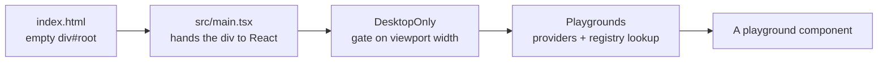
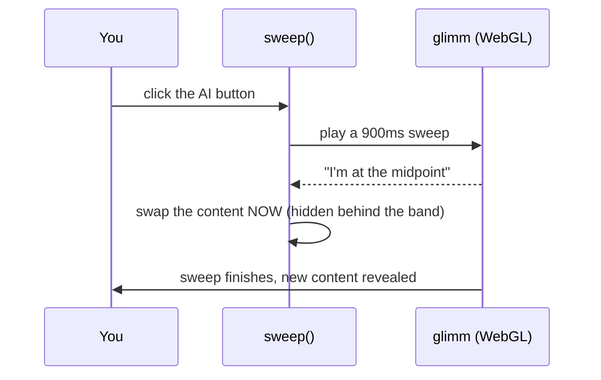

# How This Website Works

A plain-English guide to the InteractComponents playground — what it is, what
it's built with, how every piece fits together, and **why** each notable
decision was made. Where something technical matters it gets explained rather
than assumed.

The organising idea: this repo is a set of **interaction studies**, each a
faithful rebuild of a Figma design. Almost every number in the code traces back
to a specific Figma node, and where the code departs from the file, the reason
is recorded next to it.

---

## Table of contents

1. [What this website is](#1-what-this-website-is)
2. [The tech stack](#2-the-tech-stack)
3. [How the app starts up](#3-how-the-app-starts-up)
4. [The desktop-only gate](#4-the-desktop-only-gate)
5. [How pages work (the "router")](#5-how-pages-work-the-router)
6. [The shared shell](#6-the-shared-shell)
7. [Page 1 — Article Reader](#7-page-1--article-reader)
8. [Page 2 — Portfolio](#8-page-2--portfolio)
9. [Page 3 — Membership Dashboard](#9-page-3--membership-dashboard)
10. [Page 4 — Movie Choice (Move)](#10-page-4--movie-choice-move)
11. [Page 5 — Chat View](#11-page-5--chat-view)
12. [Page 6 — Join Group](#12-page-6--join-group)
13. [Page 7 — Writers Garden](#13-page-7--writers-garden)
14. [The engines](#14-the-engines)
15. [The design system](#15-the-design-system)
16. [How the animations work](#16-how-the-animations-work)
17. [Performance and capability tiering](#17-performance-and-capability-tiering)
18. [Sound](#18-sound)
19. [Where the data comes from](#19-where-the-data-comes-from)
20. [Responsiveness and accessibility](#20-responsiveness-and-accessibility)
21. [Analytics](#21-analytics)
22. [Running and building](#22-running-and-building)
23. [Full file map](#23-full-file-map)
24. [How to add a new page](#24-how-to-add-a-new-page)
25. [Known gaps and vestigial code](#25-known-gaps-and-vestigial-code)

---

## 1. What this website is

- A **front-end playground**: one website holding **seven** separate, polished
  UI demos.
- Each demo is a faithful build of a Figma design; several are displayed inside
  a **device mockup** — a fake bezel drawn entirely in CSS, no image.
- You move between demos with a small floating pager at the bottom of the
  screen.

| # | Demo | Hash | What it shows |
|---|---|---|---|
| 1 | **Article Reader** | `#/article-reader` | Long-form article with an outline minimap, a read-along "Listen" highlight, and an AI-summary view behind a WebGL sweep |
| 2 | **Portfolio** | `#/portfolio` | Finance dashboard: dithered canvas chart with spring-driven scrubbing, an odometer, currency switching, and a drill-down insights view |
| 3 | **Membership Dashboard** | `#/membership-dashboard` | Full SaaS admin screen — re-themeable sidebar, sortable/filterable/paginated member table, container-query sizing |
| 4 | **Movie Choice** | `#/movie-choice` | Film picker on a phone: posters on a physical **wheel**, genre/year/sort filters, a Shuffle that throws the wheel, synthesised sound |
| 5 | **Chat View** | `#/chat-view` | Desktop chat client rendered as a fixed 1440×1024 stage that *covers* the viewport; five rail destinations, four of them ghost frames |
| 6 | **Join Group** | `#/join-group` | Three-screen community onboarding on black: a 3D rolling cube button, a live WebGL glow field, a form, and a confetti confirmation |
| 7 | **Writers Garden** | `#/writers-garden` | Twelve badges on a horizontal rail *or* wound up a WebGL **DNA helix**, with a requirements panel |

**Important up front: there is no server and no database.**

- Everything is produced in the browser from data files that ship with the site.
- No login, no backend, no API calls.
- That makes it a *design and interaction* showcase rather than a working product.
- The one external runtime dependency: **Move's film posters are hotlinked from
  TMDB's image CDN** (`image.tmdb.org`). The film *data* ships in the bundle;
  only the artwork is fetched. Move is the only screen that needs a network
  connection to look right.

---

## 2. The tech stack

### Build tool — **Vite** (v8)

- `npm run dev` serves instantly with hot reload.
- `npm run build` type-checks (`tsc -b`) then bundles into `dist/`.
- Provides the `@/` alias → `src/` (configured in `vite.config.ts`).
- Two plugins: `@vitejs/plugin-react` and `@tailwindcss/vite`.

### Language — **TypeScript** (~6.0)

- JavaScript with labels on the data; the editor catches mistakes before runtime.
- Used heavily for small "shape" definitions:
  ```ts
  type Point = { date: string; value: number }
  ```
- The build fails on a type error, so broken types never reach production.

### UI framework — **React 19**

- The screen is a **function of state**: change a value, React redraws what
  depends on it.
- React 19 specifics used here: `ref` is an ordinary prop (no `forwardRef`
  wrapper in `IconTray`), and `useSyncExternalStore` drives both the hash router
  and the GPU-tier store.

### Styling — **Tailwind CSS v4**

- Utility classes on the element rather than separate stylesheets.
- The project defines its own vocabulary in `src/index.css` under `@theme` —
  `text-ink`, `border-hairline`, `shadow-panel`, `font-lausanne`, and so on. See
  [section 15](#15-the-design-system).

### Motion — **Framer Motion** + **GSAP**

Two animation libraries, with a deliberate split:

| Library | Owns | Why |
|---|---|---|
| **Framer Motion** | Declarative state animation: entrances, `AnimatePresence`, `layoutId` shared-element morphs, springs on `animate` props | It is the house default; `lib/motion.ts` centralises every timing |
| **GSAP** | Imperative, per-frame, pointer-driven work: card tilt in Writers Garden, the cube roll and magnetic tilt in Join Group, the spinning badge's ticker | `quickTo`/`quickSetter` reuse one tween per property instead of allocating a timeline on every `pointermove`, and `gsap.ticker` shares one frame loop across the page |

**The rule that keeps them from fighting:** two writers on one `transform`
property is a fight neither wins. So in Writers Garden the rAF scroll loop owns
the *surface* element's transform and GSAP owns the *button* (its parent) — they
compose for free. Join Group does the same with a separate tilt layer wrapping
the cube layer.

### Supporting packages

| Package | What it does here |
|---|---|
| **glimm** | Small WebGL library that draws the coloured "sweep" wipe between views |
| **gsap** | Imperative animation, as above |
| **dither-kit** | The charting toolkit (area chart, pie chart), vendored into `src/components/dither-kit/` |
| **d3-scale / d3-shape** | Pure maths for dither-kit: value → pixel position. No drawing |
| **canvas-confetti** | The Join Group "community created" burst |
| **lucide-react** | Icon set for 23 of the 24 community glyphs in Join Group |
| **clsx + tailwind-merge** | Safe class-name combination (`cn()` in `lib/utils.ts`) |
| **@fontsource-variable/geist**, **@fontsource-variable/inter** | Self-hosted variable fonts |
| **svg-country-flags** | Flag assets for the currency picker |
| **@web-kits/audio** | Synthesises Move's sounds from oscillators and noise at call time — no audio files in the bundle |
| **interface-kit** | Dev-only visual editor, mounted behind `import.meta.env.DEV` so it is tree-shaken from production |
| **@vercel/speed-insights** | Real-user performance metrics (see [section 21](#21-analytics)) |
| **tw-animate-css** | Animation utility classes for Tailwind v4, imported in `index.css`. Used by the shadcn scaffold; no playground references it directly |
| **@base-ui/react** | Headless unstyled primitives from the Base UI project. Installed alongside shadcn; none of the seven playgrounds import it — it is scaffolding, not active code |
| **oxlint** | Very fast linter. Config in `.oxlintrc.json`; ignores `dither-kit/` and `ui/` |
| **shadcn / class-variance-authority** | Installed as part of the dither-kit setup. Only `src/components/ui/button.tsx` uses them and no page imports it — scaffolding, not active code |

**`motion` v13 alongside `framer-motion` v12:** both packages appear in
`package.json`. `motion` is the successor name to `framer-motion` (same library,
same team, same API — Framer dropped the name). `framer-motion` v12 is what the
project's imports resolve to; `motion` v13 was added by the shadcn scaffold and
is unused by any hand-written code. Removing it would save a few kilobytes of
bundle but break nothing.

---

## 3. How the app starts up



1. **`index.html`** — a nearly empty page: one `<div id="root">` and a script
   tag pointing at `main.tsx`.
2. **`src/main.tsx`** — 12 lines. Finds the div, loads the global stylesheet,
   renders `<App />` plus `<SpeedInsights />` inside `<StrictMode>`.
3. **`src/App.tsx`** — splits into two:
   - `App` renders only `<DesktopOnly><Playgrounds /></DesktopOnly>`.
   - `Playgrounds` asks `usePlayground()` which demo is active, wraps it in
     `SoundProvider` and `SweepProvider`, and mounts the pager.
4. **The playground component** renders the dozens of smaller components that
   make up its screen.

**Provider ordering, and why:**

- `SoundProvider` sits above the switcher because it owns **one master audio bus
  for the whole app** — a playground swapping underneath should inherit it, not
  build its own.
- Nothing starts an `AudioContext` at mount. `@web-kits/audio` opens one lazily
  on the first sound, and every sound in the app is triggered by a click — so
  the context is always created inside a user gesture, which is the only way a
  browser lets it start unsuspended.
- `SweepProvider` also stays above the switcher so every playground's
  `DeviceFrame` can mount the sweep canvas whether or not it triggers a sweep.

**The `key` on the active component:**

```tsx
<Component key={active.id} />
```

The `key` tells React "this is a *different* component when the id changes."
Without it React reuses the old one and silently keeps its state; with it every
demo gets a clean start and replays its entrance animation.

---

## 4. The desktop-only gate

`src/components/DesktopOnly.tsx` — the outermost thing in the tree.

**What it does**

- Below **1024px** viewport width, the entire app is replaced with a single
  explanatory screen.
- It sits *above* the hash router and both providers, so on a narrow viewport
  nothing below it mounts at all: no playground fonts, no canvas, no audio graph.

**Why 1024px**

- `DeviceFrame` renders a desktop mockup that maxes out at 1156px.
- Several playgrounds hang real affordances off hover — the switcher's morph,
  the article minimap's magnification, the pie tooltip, the Writers Garden card
  tilt — and those paths are unreachable without a fine pointer.
- Below roughly this width the frame stops reading as a monitor. Saying so is
  more honest than reflowing into a layout nobody designed.

**How the check works**

- `matchMedia('(min-width: 1024px)')`, read **in the `useState` initialiser** so
  the very first paint is already correct — a mobile visitor never sees a frame
  of the desktop mockup before the notice replaces it.
- A `change` listener keeps it live, so resizing a desktop window narrow crosses
  into the notice and back out again.
- The effect also re-syncs once on mount, since the viewport can change between
  the state initialiser and the effect (orientation, browser chrome collapsing).

**The notice itself** (Figma 332:4549 / 332:4551)

- A phone outline with a dynamic island, drawn in CSS, that deliberately
  overflows the bottom of the viewport and is cropped by `overflow-hidden`.
- **Every mockup measurement is a fraction of viewport *width*, not height** —
  93.24% wide, a 15.34% corner radius, an island 24.77% across. Driving the
  corner radius off height would oval it on a phone and flatten it on a tablet.
  Each value caps at the design's own px number via `min()`, so above a 730px
  viewport the mockup stops growing and centres.
- The bottom fade is the one thing **not** taken proportionally. In Figma it's a
  fixed 233px band on a 730×1024 artboard; applying the same fraction to a
  390×844 phone would put it two-thirds up the screen with 300px of outline
  re-emerging underneath. It is anchored to the bottom of the viewport instead,
  so the outline dissolves once and stays gone. The gradient stops are the
  design's exactly.
- Content sizes use `clamp()` capped at the design's values, since the gate's
  range has to cover a 320px phone *and* a narrow desktop window with one set of
  numbers.
- **Body copy stays at a flat 14px.** It is the one measurement already sized for
  a phone; scaling it down with everything else would buy proportion at the cost
  of legibility.
- The document is pinned (`overflow: hidden` + `overscroll-behavior: none` on
  `body`, restored on unmount) — the same bargain `MobileFrame` makes. The notice
  fills the viewport exactly, so a mobile URL bar collapsing and handing back the
  difference between `svh` and `lvh` would otherwise become a scroll that drags
  the whole screen.
- The `@femolaaa` credit link's tap target is its padding, not the 24px avatar:
  20px above and 12px on the other three sides puts it at 56px tall, clear of the
  44px minimum a thumb needs, with `-mb-3` cancelling the extra so it still sits
  where the frame puts it.

---

## 5. How pages work (the "router")

Most React sites use a routing library. This one has seven pages and about 35
lines instead.

### The registry — the list of pages

`src/playgrounds/registry.ts` is a plain array:

```ts
export const playgrounds: Playground[] = [
  { id: 'article-reader',       label: 'Article Reader', Component: ArticleReader },
  { id: 'portfolio',            label: 'Portfolio',      Component: Portfolio },
  { id: 'membership-dashboard', label: 'Membership',     Component: MembershipDashboard },
  { id: 'movie-choice',         label: 'Movie Choice',   Component: Move },
  { id: 'chat-view',            label: 'Chat View',      Component: ChatView },
  { id: 'join-group',           label: 'Join Group',     Component: JoinGroup },
  { id: 'writers-garden',       label: 'Writers Garden', Component: WritersGarden },
]
```

- Three fields: `id` (URL hash, kebab-case, stable), `label` (shown in the pager
  — keep it short, the pill is narrow), `Component`.
- **This array is the single source of truth** — the pager, the URL handling and
  the page order all read from it.
- Array order is display order. `defaultPlaygroundId` is the first entry.

### The hook — which page is active

`src/playgrounds/usePlayground.ts` keeps the active page **in the URL hash**:
`yoursite.com/#/portfolio`.

Storing it there buys three things for free:

- The URL is **shareable**.
- It **survives reload**.
- The **back button works**, because changing a hash adds a history entry.

Implementation notes:

- Built on `useSyncExternalStore` subscribing to `hashchange`, so React never
  tears between the hash and what it rendered.
- Unknown or missing hashes fall back to the first entry — `#/banana` shows the
  Article Reader rather than a blank screen.
- A `useEffect` sets `document.title` to `${label} · Playground`.
- The server-snapshot function returns `defaultPlaygroundId`, so this is safe if
  the app is ever pre-rendered.

### The pager — switching pages

`PlaygroundSwitcher.tsx` — the floating pill at the bottom.

- **Two states, both always mounted:** a collapsed dot-pill (one dot per
  playground, the current one widened into a capsule) and the expanded
  `‹ Article Reader ›` pager. It springs open on hover or keyboard focus.
- The collapsed state still says *where you are and how many there are* — the
  chrome shrinks without the wayfinding going with it.
- **The morph is built by animating real width/height**, not Framer's `layout`
  prop. Layout projection animates a box by *scaling* it, which visibly stretches
  every child that isn't itself projected — exactly the smear you get on text and
  5px dots. Animating real dimensions keeps both layers laid out correctly every
  frame.
- Both faces are measured with `useMeasure`, which reads `offsetWidth` (not
  `getBoundingClientRect`) in a **layout effect**. A rect is post-transform, and
  the node sits inside a layer that animates `scale` — measuring it would feed the
  box a size that shrinks with its own cross-fade. The layout effect means the
  pill is never painted at the wrong size on its first frame.
- Faces are cross-faded with a **blur**: opacity alone reads as two things
  swapping; a layer that defocuses as it leaves and pulls sharp as it arrives
  reads as one thing changing shape. Scale is on a spring; opacity and blur are
  on curves, because a spring on either can overshoot its own legal range and
  flicker at the ends.
- The incoming face waits 40ms — the box is already springing open, and content
  arriving with it fights the movement instead of following it.
- Arrows step through the registry and **wrap around**. Left/Right arrow keys do
  the same, from the pill itself or from either button.
- The label slides **in the direction you travelled** (a `directionRef` set by
  whichever control caused the change).
- The label sits in a fixed **168px** box so the pill doesn't resize as names of
  different lengths swap through.
- Only *keyboard* focus pins it open (checked with `:focus-visible` in
  `onFocusCapture`) — a mouse click on a chevron would otherwise leave the pager
  stuck open after the pointer left.
- An invisible `before:-inset-3` hover buffer surrounds the pill. Collapsed it is
  a ~70×22 target, and without slop the open/close flickers as the pointer grazes
  the edge.
- Hidden faces get `inert`, so the offscreen layer can't be clicked or tabbed into.
- On coarse pointers (`(hover: hover) and (pointer: fine)` fails) it is
  **always expanded** — there is nothing to hover with.
- It is `position: fixed` and floats *over* the bottom of the device mockup,
  because the mockup deliberately runs off the bottom of the screen.

---

## 6. The shared shell

### `DeviceFrame` — the laptop mockup

`src/components/DeviceFrame.tsx`, pure CSS:

```
┌────────────────────────────────────┐  ← outer bezel (1.5px border, 45px radius)
│ ┌────────────────────────────────┐ │  ← 7px gap
│ │       ▂▂▂▂▂ notch              │ │  ← inner screen (white, clipped)
│ │        page content            │ │
```

- **No bottom border** (`border-b-0`) and it runs off the bottom of the viewport
  — that is what makes it read as a laptop propped up rather than a floating
  rectangle.
- **The screen clips its contents** (`overflow: hidden` + corner radius), which
  keeps the WebGL sweep and the Portfolio sheet from spilling past the "glass".
- **Height is explicit** (`h-svh`), not `flex-1`. A scrollable area can only
  scroll if every parent above it has a *definite* height — a common source of
  "why won't this scroll" bugs.
- `svh`, not `dvh`, so the frame doesn't resize as mobile browser chrome hides.
- **There is deliberately no minimum height.** It used to carry a 560px
  `min-h-frame-floor`, and that was a bug: browser zoom shrinks the CSS viewport
  below it (200% of an 880px window is 440px), and an overflowing frame splits
  the UI in half — everything pinned to its bottom edge falls below the fold,
  everything pinned to its top leaves the screen as soon as you scroll to reach
  it. No scroll position showed both. The pane already scrolls on its own, so
  letting the shell compress degrades far more gracefully.
- The notch adapts: a Dynamic Island-style pill at mobile widths, a wider webcam
  bar at `sm:` and up.
- Max width 1156px.

**Who uses which shell:**

| Playground | Shell |
|---|---|
| Article Reader, Portfolio | `DeviceFrame` |
| Movie Choice | `MobileFrame` |
| Membership Dashboard, Chat View, Join Group, Writers Garden | none — each owns its own full-screen stage |

### `MobileFrame` — the portrait phone shell

`src/components/MobileFrame.tsx` — the mirror image of `DeviceFrame`.

- Where `DeviceFrame` shows the *top* of a device and bleeds off the bottom
  (`rounded-t`, `border-b-0`), this shows the *bottom* and bleeds off the top
  (`rounded-b`, `border-t-0`).
- The Figma phone is 1426px tall on a 1024px artboard at y=-471, so the island
  is above the fold — and no island is drawn, because rendering one would invent
  chrome the design doesn't show.
- The Figma bottom edge lands at y=956, leaving 68px of white beneath the phone.
  **That gap is kept rather than trimmed** — it is exactly where the floating
  `PlaygroundSwitcher` sits.
- The bezel is a **constant 8px gap** with two concentric radii (screen 52,
  bezel 60). A constant-width gap all the way round is what makes it look
  machined rather than drawn; a fixed border width would pinch at the corners.
- Takes a `backdrop` **node**, not an image `src` — a page may want to cross-fade
  or blur its own layers into that slot, and the frame has no business knowing
  which.
- Pins `document.body` overflow while mounted, for the `svh`/`lvh` reason
  described in [section 4](#4-the-desktop-only-gate).

### `SweepProvider` — the WebGL transition

`src/components/sweep.tsx`, powered by **glimm**.



- The swap happens at the band's **midpoint**, so you never see the change — the
  band is covering it. That is the whole illusion.
- glimm's own `<GlimmProvider>` mounts its canvas as `position: fixed; inset: 0`,
  which would sweep the entire browser window. This drives glimm's
  framework-agnostic core (`createShader` + `playSweep`) instead and injects the
  canvas into a **host element inside the device screen**, so the sweep is clipped
  to the mockup.
- The canvas is rebuilt when the host changes: switching playgrounds remounts the
  device frame, so a canvas built for a previous host is detached and would sweep
  nothing.
- **Graceful degradation:** no WebGL, or `prefers-reduced-motion`, and the sweep
  is skipped — `navigate()` simply runs. Nothing breaks.
- Shared through React **context** (`sweep-context.ts`), which exposes `sweep()`
  and a `hostRef` callback. `useSweep()` throws a clear error outside the provider.
- House defaults: 900ms sweep, 600ms outro, `bandTight: 24`, `easeInOutCubic`,
  `ltr`. Every call can override them — Join Group does (see
  [section 12](#12-page-6--join-group)).

---

## 7. Page 1 — Article Reader

Source: `src/playgrounds/ArticleReader.tsx`. A three-column reading experience
inside `DeviceFrame`.

```
┌─────────────┬───────────────────────────┬─────────────┐
│  outline    │ ▨▨▨ hatch band ▨▨▨        │             │
│  minimap    │  The Historical Age of    │             │
│  ▬▬▬▬       │  AI and Human Collab...   │             │
│  ▬▬▬▬▬      │  ▶ Listen  Share  Options │             │
│  ▬▬▬        │  Body text scrolls here…  │      (⚡)    │
│  ✎ 3 days   │  ░░░ blur fade ░░░        │   Ask AI    │
└─────────────┴───────────────────────────┴─────────────┘
```

### `OutlineMinimap` (left rail)

- An abstract map of the article: each section owns a run of grey dashes; the
  current section's lines turn dark.
- **Magnification:** as the cursor moves down the rail, lines reach further right
  the closer they are to the pointer, falling off on a bell curve. Heights and
  spacing never change, so the outline never reflows — the effect runs sideways
  only.
- Clicking a section smooth-scrolls the article to it.

### `useActiveSection`

- Listens to the reading pane's scroll and picks the last section whose top has
  passed an imaginary line **35% down the pane**.
- 35% is deliberate: using the very top would flip the highlight a beat too early.

### `HatchBand`

- The diagonal-striped strip above the article.
- When "Listen" is active, a soft gradient sweeps across it on a loop, like a
  progress shimmer.

### `ArticleBody` and the content model

The article is data, not markup. `src/content/article.ts` describes it as typed
blocks:

```ts
{ kind: 'p',     text: '…' }              // paragraph
{ kind: 'h2',    text: '…' }              // heading
{ kind: 'quote', text: '…' }              // pull quote
{ kind: 'list',  intro: '…', items: […] } // bulleted list
```

`ArticleBody` walks that list and renders the right element for each `kind`.
Change the content file and the article changes — no layout code touched.

**`ListenButton`** — the narration control, and it has **three** states rather
than two: `idle` → `playing` → `paused`. The distinction earns its keep. `idle`
is where the page loads, with nothing read yet and so no place to hold; once
narration has started the button only ever moves between playing and paused, and
a pause keeps its place in the text.

The icon and the label are animated by two different mechanisms, for two
different reasons:

- **The icon** shows the *action*, not the state — pause while it runs, play
  both before it starts and while it's held. Both icons live in the same grid
  cell, and one fades and rotates out as the other fades in.
- **The label** is a single vertical strip of all three words (`Listen`,
  `Playing`, `Paused`) clipped to one 16px line box, slid by
  `y: -index × 16`. A strip rather than a swap means it always travels the short
  way between two neighbouring words, with no bookkeeping about which state came
  before — and because the words are stacked, the button keeps the width of its
  widest one and never resizes under the pointer mid-toggle.

*It still doesn't play real audio — the "narration" is a highlight moving
through the text, not a voice.*

**`useReadingCursor` + `reading.ts`** — what that highlight actually is.
`reading.ts` tokenises the article into words; `useReadingCursor` advances an
index through them on an interval at **150 words per minute**, which is a slow
speaking pace rather than a reading one — roughly 400ms a word, which the eye
can comfortably ride.

The three states are the reason this hook is more than a `setInterval`:

| State | Cursor | Behaviour |
|---|---|---|
| `idle` | `null` | Nothing has been read; no mark is drawn |
| `playing` | advancing | The interval runs |
| `paused` | frozen, still visible | The mark parks where the reader left it |

**A pause is a bookmark, not a stop.** The index survives it, so resuming picks
the sentence back up — and `paused` still *reports* a word, so the mark stays on
screen rather than vanishing while you're stopped. Only `idle` rewinds to zero,
and the only route back to `idle` is a reload, which takes the whole page state
with it anyway.

**`AskAiFab`** — the round gradient button. Its background is a four-colour
gradient slowly drifting on a 9-second loop, it shows a tooltip on hover, and
clicking it triggers the sweep transition to the AI summary view.

**`ProgressiveBlur`** — the fade at the bottom of the reading pane. This is more
interesting than it looks. A single `backdrop-blur` gives a hard edge where the
blur starts. This component instead stacks **ten** thin blur layers with
gradient masks, each one calculated so the *cumulative* blur ramps smoothly from
0 to ~4.9px — matching the exact curve Figma specified. (Stacked blurs compound
in quadrature, not linearly, which is why the maths in that file looks like it
does.)

### What happens when you click "Ask AI"

1. `toggleView()` calls `sweep()`, starting the WebGL band.
2. At the midpoint: `view` flips `'article'` → `'summary'`, and the pane scrolls
   to the top.
3. React swaps `<ArticleBody />` for `<AiSummary />`.
4. The band finishes and reveals the summary.

Clicking again sweeps **in the opposite direction** (`rtl` instead of `ltr`), so
the motion reads as returning rather than advancing.

---

## 8. Page 2 — Portfolio

Sources: `src/playgrounds/Portfolio.tsx` and
`src/components/PortfolioInsights.tsx`. Really *two* screens sharing one shell.

### View A — Performance

- **Range tabs (1M / 3M / 6M / 1Y)** slice a fixed 53-week series to the last
  5/14/27/53 points.
- The data isn't random — it's a fixed array shaped to match the Figma curve,
  with older weeks generated from a sum of sine waves. Deterministic, so it looks
  identical on every reload.

**Scrubbing the chart** is the standout interaction:

- The big number rolls to that week's value.
- The "15% down from last month" line is replaced by that point's full date.
- The fill goes grey *past* your cursor, so the coloured part reads as "up to
  here".
- That grey boundary is a **real spring simulation** — a damped harmonic
  oscillator (`F = −kx − cv`) integrated inside the canvas's own animation loop
  at a fixed **4ms substep**, so it behaves identically on 60Hz and 120Hz screens.
- **Why:** locking the boundary rigidly to the cursor felt lifeless; giving the
  block of colour a little inertia is what makes it feel physical. The crosshair
  itself still tracks the pointer exactly — only the colour lags.

**`RollingNumber`** — the odometer. Each digit is its own clipped window with a
0–9 strip springing behind it, staggered so the ones place leads. Three invisible
problems it solves:

| Problem | Fix |
|---|---|
| **Digit widths** | `tabular-nums` makes a `1` occupy the same width as a `0`, so the number doesn't jitter as digits change |
| **Keying from the right** | When the value crosses a digit count ($9,900 → $10,100), numbering columns from the left renumbers every column and rolls digits that never changed. Numbering from the right keeps them still |
| **Kerning** | Splitting text into per-character boxes loses the spacing the font applies between glyph pairs. The component *measures* the real string against the sum of its boxed characters and spreads the difference back across the boxes — landing within 0.05px of normally-set text |

- Free bonus: each digit's motion blur is derived from its own **velocity**, so a
  one-step tick barely blurs while a 9→0 rewind smears and lands crisp.
- Under reduced motion it jumps to its value instead of rolling.
- The rolling digits are hidden from assistive tech; the component exposes a
  plain `aria-label="$52,487.00"`.

**Currency switching** (`CurrencySelect`) multiplies the amount by a fixed rate
and swaps the symbol. The rates in `lib/currencies.ts` are **fixed reference
numbers, not live FX.**

**The "Portfolio Insight" key** is animated like a physical keycap:

- Hovering takes a third of the throw; pressing takes the rest.
- The cap's downward offset and the shadow "lip" height **always sum to 3px**, so
  the key's *bottom edge never moves* — only the cap travels down onto its base.
- Animating position alone would look like the button sliding rather than being
  pressed.
- The lip uses a `drop-shadow` **filter**, not `box-shadow`, so it follows the
  border's rounded outline instead of squaring off behind it.

Clicking it sweeps **bottom-to-top** into:

### View B — Insights

Five holdings (NVDA, AAPL, MSFT, AMZN, TSLA):

- A **pie chart** or a single **allocation bar**, toggled by a tab. Both are
  painted with the same dither material, so switching changes the *shape*, not the
  visual language.
- Hovering a slice or segment shows a card with that holding's value and a
  written insight, **and** highlights the matching table row with animated
  diagonal stripes in that holding's colour (`.row-hatch`, driven by
  `data-active` so the pie can drive the row).
- A **holdings table** with price, shares, allocation %, change, market value.
- A **month picker** that regenerates the numbers.

**The seeded generator** (`lib/holdings.ts`, `mulberry32`) is a deliberate design:

- A random seed is picked once when the view mounts, so the portfolio looks
  different on each visit.
- But because the generator is deterministic, revisiting a month you've already
  viewed *this session* reproduces exactly the same numbers.
- Randomised, but not unstable.

Both views share the same `PortfolioSheet` shell — same size, radius, shadow and
padding — specifically so the swap underneath the sweep never moves or resizes
the card.

---

## 9. Page 3 — Membership Dashboard

Source: `src/playgrounds/MembershipDashboard.tsx`. A full admin screen, no device
mockup — it fills the browser window directly.

**Workspace switching re-themes the sidebar.**

- Each workspace has an accent colour and a deep background tone.
- Picking a different one crossfades the sidebar background over 400ms.
- The logo tile's colour isn't hard-coded — it's *derived* from the background by
  `lib/color.ts`, which converts hex → HSL, adds lightness points, and converts
  back. Adding a workspace means adding two colours, not five.

**The nav highlight slides.**

- The glow behind the active row uses Framer Motion's `layoutId`: when two
  elements in different places share one, Framer animates *between* the positions
  rather than removing one and adding another.
- That is why the glow slides down the menu instead of blinking.

**The table** is a real data grid over 200 sample members:

| Feature | How it works |
|---|---|
| **Sorting** | Click a header to sort, click again to reverse. Tier sorts by its label, not its internal id |
| **Filtering** | Tier and Company headers open a checkbox menu. Multiple selections are OR'd; a dot marks a live filter |
| **Pagination** | 10/15/25/50 rows. Any sort or filter change resets to page 1 — otherwise you can be stranded on a page that no longer exists |
| **Selection** | Per-row checkboxes plus select-all-on-page; count shown in the header. Stored in a `Set`, so checking is O(1) regardless of list size |

The pipeline is a chain of memoised steps, each recalculating only when its own
inputs change:

```
MEMBERS → filter (tier, company) → sort (key, direction) → slice (page) → render
```

**Sizing uses container queries.**

- `@container` on the root, and units like `clamp(11px, 1.3cqw, 13px)`.
- `cqw` is 1% of the *container's* width, not the viewport's.
- So the dashboard scales proportionally to the space it is given rather than to
  the browser window — every font size, column width and padding has a floor, a
  fluid middle and a ceiling.

---

Source: [`src/playgrounds/Move.tsx`](src/playgrounds/Move.tsx) — at ~2,180 lines,
the largest screen in the project.

Source: `src/playgrounds/Move.tsx` (~2,180 lines — the largest screen). A film
picker in portrait, inside `MobileFrame`.

### The wheel is the whole idea

- Every other carousel on the web is a **track**: cards slide flat, left and right.
- This is a **wheel**. Posters are chords on a single circle, and stepping forward
  rotates the entire circle — a card doesn't slide off the edge, it *tips away and
  drops under the rim*.

That one decision drives all the geometry, and the numbers are **solved rather
than guessed**:

| Constant | Value | Why |
|---|---|---|
| `WHEEL_STEP_DEG` | `14°` | The only free parameter. Past ~20° the poster title looks dropped; under ~8° the wheel flattens back into a track |
| `wheelRadius(pitch)` | `pitch / 2·sin(θ/2)` | Derived from the chord formula. The eye measures the *chord* between cards, not the arc — so solving it keeps the design's 20px gutter at every screen width. A narrower phone tightens the circle instead of letting cards drift apart or overlap |
| `SEAT_SCALE` | `0.874` | Each card shrinks per detent away from centre, so it reads as falling *away from you*, not merely tipping. Taken from the design's 524.6×766.9 neighbour against a 600×877 centre — the same ratio on both axes and on the corner radius |
| `PANEL_RADIUS` | `30` | Bottom corners always; the top pair only once the card is off the fold |

- Scale and corner rounding are solved from the wheel's **live angle**, not the
  card's index, so a poster grows and its top corners open continuously as it
  travels into the centre rather than popping when the index changes.

### The throw: two acts

`lib/motion.ts` holds the whole model, and it is deliberately small:

- **The cruise is authored** — a flat, fast, constant-speed section. `SPIN_TEMPO`
  is 85ms per card, about as tight as the beeps can be packed and still be
  counted (the pip's envelope runs ~54ms; under ~70ms they smear into a buzz).
- **The ending is not authored.** It is `springThrow` released into the final
  detent with the cruise's velocity still in it. A hand-built ritardando is a
  guess at a curve physics already knows.
- `SPIN_SECONDS = 4`, `SPIN_SETTLE = 1.1` (the spring's tail), so
  `SPIN_THROW = 2.9`.
- `SPIN_SETTLE` is sized by where the **last card arrives**, not by the spring's
  own settling time — a second-order settle is asymptotic, and giving the spring
  the full time it wants buys half a second of dead air.
- `SPIN_COAST_DETENTS = 3`, from `coast ≈ rate × ζ × arrival-time / 5.9`. Five was
  tried and is where it went wrong: a spring soft enough to coast five cards is
  still 300px from its seat when the last card crosses.
- `springThrow` itself is solved: to shed velocity `v` over distance `d` without
  sailing past, `ωn ≈ v/d`. 164°/s over 42° gives `ωn ≈ 3.9`, so
  `stiffness = ωn² ≈ 15.3` and `damping = 2ζωn ≈ 7.35` puts ζ at 0.94.
- `SPIN_ARRIVED = 0.013` — "arrived" as a fraction of one card pitch (~8px at the
  design's 620px card). It needs a threshold at all because the approach is
  exponential. Both obvious signals are wrong: the final detent crossing is half a
  pitch out with 950px/s still on the card, and Framer's `onComplete` calls it
  finished with 22px to go, because its rest thresholds are tuned for pixel-scale
  values and this one is in degrees.
- `springWheel` is a `SpringOptions` (for `useSpring`), **not** a `Transition`. A
  `Transition` spring is re-solved from rest each time the target changes; a
  `useSpring` integrates one continuous state, so velocity survives a new target.
  That is the point: hold the next key and each press lands on a wheel already
  moving, and the steps compound into one accelerating spin instead of a queue of
  identical hops.

### Shuffle, part 1: a throw made of physics rather than a timetable

Shuffle spins the wheel across the library for four seconds and lands on a film
it picked at the press. How that four seconds is *shaped* was rebuilt, and the
rebuild is the most interesting thing on the screen.

**What it used to be:** one timing table — fourteen keyframe times on a
geometric ritardando (each gap 1.14× the last), with the audio reading the same
array so the clicks couldn't drift from the cards.

**What it is now:** two acts, and only the first is authored.

| Act | Length | What drives it |
|---|---|---|
| **Cruise** | `SPIN_THROW` = 2.9s | Flat, constant speed — one card every `SPIN_TEMPO` = **85ms** |
| **Settle** | `SPIN_SETTLE` = 1.1s | `springThrow`, released into the final detent with the cruise's velocity still in it |

The insight is that a wheel's *throw* is a decision — how fast, how long — but
its *ending* is not. That's just what a mass with drag does when you stop
pushing it, and every number in a hand-built ritardando is a guess at a curve
physics already knows. So the cruise is the only thing written down, and the end
is a spring let go.

**`springThrow` is solved, not tuned by eye.** To shed a velocity `v` over a
distance `d` without sailing past the target, a second-order system wants
`ωn ≈ v/d`. The cruise runs 34 cards / 2.9s × 14° = **164°/s**, the coast is
three cards of 14° = **42°**, so `ωn ≈ 3.9 rad/s` — giving `stiffness = ωn²`
≈ 15.3 and `damping = 2ζωn` ≈ 7.35, which puts ζ at 0.94. Just *under* critical,
deliberately: overdamping reads as the wheel being **held** rather than running
out, and it's also slower, since the dominant pole of an overdamped pair drifts
toward zero.

Three things the old table had to fake now fall out for free:

- **The wheel eases in.** `springWheel` needs ~0.3s to reach cruise from rest,
  so the reel spins up instead of starting at full speed.
- **The ritardando is real.** A second-order settle, not 1.14 per step.
- **The sound follows** — which is the next section.

**Why three coasting cards and not five.** `SPIN_COAST_DETENTS` trades directly
against how cleanly the card arrives, via one relation:
`coast ≈ rate × ζ × arrival-time / 5.9`. At 11.7 cards/s and a 1.1s tail that's
three. Five was tried and it's where this went wrong: a spring soft enough to
coast five cards is still 300px from its seat when the last card crosses, then
crawls the rest over another 800ms. The ritardando *sounded* better and the card
never quite landed — the ending you could hear and the ending you could see were
half a second apart.

**"Arrived" needs its own threshold** (`SPIN_ARRIVED`, 1.3% of a card ≈ 8px)
because an exponential approach never strictly gets there. Both obvious signals
are wrong: the final detent crossing is half a pitch out with 950px/s still on
the card, and Framer's own `onComplete` calls the spring finished with 22px to
go and 187px/s of movement left — its rest thresholds are tuned for values at
pixel scale, and this one is in degrees.

### Shuffle, part 2: hiding a cut with a focus pull

Shuffle can land on a film from a genre the wheel was never spinning through —
so there's nothing to travel past, and the deck has to change in a single frame.
A visible swap would read as a glitch.

The fix is a **focus pull**, and the ordering is the entire trick:

1. Over the **last 350ms of the cruise** (`LANDING_DEFOCUS`, delayed to end at
   the handover), blur rises to **22px**. The picture is gone *before* anything
   changes, so the last card the reels showed is never seen to be the wrong one.
2. The deck swaps under cover of that blur.
3. Focus returns — and it returns on **the same spring the wheel is settling
   under**, not on a duration of its own.

Raising the blur *before* the swap rather than at it isn't a refinement, it's the
only order that works: `useEffect` runs after paint, so a blur applied on landing
would arrive one frame late — and that one frame of a fully sharp wrong poster is
exactly the cut the effect exists to hide.

**How the blur stays locked to the wheel.** The reveal runs `springThrow` with
`velocity: SPIN_FOCUS_RATE`. A spring is linear, so two values given the same
spring and the same *normalised* initial velocity trace the same curve whatever
their units. The wheel enters the coast at `SPIN_CRUISE_RATE` cards per second
with `SPIN_COAST_DETENTS` cards to go; divide one by the other and the cards
cancel, leaving the fraction-of-the-journey per second a focus running 1 → 0 has
to start at to arrive in step. That's what makes "the card comes into focus as it
eases into place" a fact rather than two animations tuned until they looked
close — retune `springThrow` and the two stay locked, because neither holds a
duration.

The house lights (`0.45s`) still come up *before* the picture sharpens, because
that's the order those two things happen in a real room. They're triggered off a
separate `coasting` flag set at the handover rather than off the spin ending, so
the room brightens as the throw stops being a throw — not a second after the
card has already resolved.

A genre change is **the same reveal at a different length**: a much shorter
defocus (`GENRE_DEFOCUS`, 160ms) and a plain curve back, since there's no wheel
settling for it to ride.

### The rest of the screen

- **Genre tray** — seven genres (Action, Animation, Comedy, Musical, Romance,
  Sci-Fi, Sport), each with its own icon and tile colour. The pill and the expanded
  tray share a `layoutId` (`GENRE_SURFACE`) so they read as one surface morphing
  open, not two elements swapping.
- **Filter menu** — year and sort (`featured`, `rating`, `newest`, `oldest`,
  `runtime`). The year list is derived from what's actually in the current genre,
  so you can never filter to an empty deck.
- **Frosted glass** — every translucent surface is built from one warm white,
  `rgb(252,250,246)`, with alpha composed per surface. Two points of blue removed
  from the design's flat 250 is imperceptible as *colour* and unmistakable as
  *temperature* — it's what stops the tray reading as a grey card on a warm screen.
- **Colour discipline** — icons inside anything pressable are flat black. Colour is
  reserved for the three meta chips (year, runtime, rating), where hue separates
  the three facts faster than their shapes do.

### Supporting pieces built for this screen

| File | What it does |
|---|---|
| `MobileFrame.tsx` | The portrait phone shell (see [section 6](#6-the-shared-shell)) |
| `squircle.ts` + `useSquircle.ts` | Figma's corner smoothing as an SVG path. CSS genuinely cannot express this: `border-radius` draws a circular arc, and even `corner-shape: superellipse()` varies the curve *inside* the radius box |
| `MiddleTruncate.tsx` | `head… tail` truncation, snapped outward to whole words so the cut never lands mid-word |
| `films.ts` | 207 films — artwork URL, synopsis, runtime, year, and a rating carried onto the design's five-point scale (TMDB's 79% → 4.0) |

---

## 11. Page 5 — Chat View

Source: `src/playgrounds/ChatView.tsx`, Figma node 308:454 "Conversation Web".

### The composition is three nested crops, and the cropping *is* the design

| Box | Size | Position | Note |
|---|---|---|---|
| Artboard | 1440×1024 | — | The stage |
| MacBook | 1410×980 | (142, 104) | Runs 112px past the right edge and 60px past the bottom — both cut off |
| Screen glass | 1348×912 | (152, 112) | Only its **top-left** corner is rounded; the other three are outside the artboard |
| The app | 1470×1080 | (0, 0) of the glass | 122px of width and 168px of height sit behind the bezel — which is where the rail's help and account buttons live, at y≈1016 |

### `useCoverScale` — the key rendering decision

- One fixed **1440×1024 stage** with every Figma coordinate intact, scaled to
  **cover** its container. Nothing inside reflows — a wider window shows the design
  bigger, never rearranged.
- `Math.max` of the two ratios, not `min`, and uncapped. Fitting the whole artboard
  inside the window is the wrong goal: the artboard is not the picture, it is a
  window onto a laptop that already runs off its own right and bottom edges.
  Letterboxing adds a second, outer frame around a design whose entire composition
  is "this is cropped".
- Anchored **top-left** — the corner every margin in the design is measured from,
  and the only one with content against it. The axis that doesn't drive the scale
  bleeds further off-screen in the direction it was already bleeding, which is why
  cropping harder never reveals an edge the design meant to hide.
- `overflow-hidden` is load-bearing even at scales above 1: the crop is the design,
  so it has to travel with it.
- Driven by a `ResizeObserver` in a layout effect.

### Two independent selections

- The sidebar runs **two selections at once** — the *view* you are in (My inbox,
  etc.) and the *conversation* you have open.
- They therefore **cannot share a `layoutId`**: two live elements under one id is
  exactly what makes a shared-layout chip tear between them. Hence `chipId` as a
  prop, with `chat-view-chip` and `chat-thread-chip` as separate ids.
- On "My inbox" both are lit at once. Only "My inbox" opens a thread — the other
  filters keep the empty pane the design actually draws.
- The pill spring is stiff and heavily damped (`stiffness 500, damping 40, mass
  0.6`) so the chip arrives under the cursor rather than swinging past it. Same
  tuning as the Membership sidebar.

### Ghost content

The Figma file only draws the Messages destination. Rather than leave a
conversation on screen under a different lit glyph:

- **`GhostConversation`** stands in for the chat pane — header, thread, composer —
  as ghost boxes. The header carries the **real contact** (name and avatar),
  because that's the one thing ghosts cannot say; without it, selecting a pinned
  chat changes nothing on screen and the highlight means nothing.
- The thread script (`GHOST_THREAD`) is **authored, not generated**. A random
  thread re-rolls on every render and the pane flickers, and a thread that changes
  shape while you look at it stops reading as a screenshot of one.
- `threadFor(seed)` rotates that one script by the contact's sidebar position, so
  each thread looks different without any of them being random — same contact,
  same thread, every time.
- Sized to the **visible** pane (1080×912), not the app's 1470×1080. Anchoring to
  the app would push the composer 168px below the bezel where nobody would see it.
- **`RailGhostViews`** fills in the other four rail destinations, held together by
  two rules: *geometry* (every frame keeps the shell's furniture where the file
  puts it — the 223px column at (44,12), the rule at x=267, the 44px header band)
  and *strength* (real controls at full strength, placeholders in a muted pair).
- The muted pair (`GHOST_SOFT` / `GHOST_SOFT_DEEP`) is both tones mixed 60/40
  toward the canvas. A chat thread is a dozen bubbles on an empty pane; a dashboard
  is placeholder edge to edge, and that much fill at conversation strength stops
  reading as absence and starts reading as content.

### Small details worth knowing

- **`PresenceDot` is placed by its core, not its box.** Figma bakes the drop shadow
  into the artboard, so the file is 8×8 while the bead is a 4px circle centred at
  (3.52, 3.52). Flushing the box to the avatar's corner would leave the visible dot
  ~3px inside where the design puts it, and the error grows with the box.
- **Rail icons cross-fade two mounted images** rather than swapping `src` — the
  inactive glyph unloads a frame before the active one paints.
- **Dividers are carved, not drawn.** `GROOVE` is a 1px rule with a
  `rgba(255,255,255,0.8)` line under it: the design carves dividers into the
  `#f8f9fd` canvas rather than drawing them on top. The vertical rule at x=267
  deliberately has none.
- The unread badge's five-layer shadow (two lifts, three inner lights) is what
  makes it a physical bead; dropping the insets flattens it into a red circle.
- Only the **outer** bezel rect is drawn. The file has a second inner rect at
  (151, 111); at this scale it reads as a doubled edge rather than machined metal.
- Search filters all three lists live, with an explicit empty state.
- Set in **Test Söhne** end to end: Buch for labels, the Breit cut for the
  "Conversations" title, Mono for the PINNED CHATS / GROUPS headers. Labels carry
  the `"salt"` stylistic set (single-storey `a`, straight-tailed `l`).

---

## 12. Page 6 — Join Group

Source: `src/playgrounds/JoinGroup.tsx`, Figma node 309:977. Three screens:
**landing → form → created**.

### The stage, and why it isn't reproduced

- The file is a 1920×1428 presentation slide, and almost none of that is the
  design: one 558px column sits at x=680 with 682px of empty board to its right.
  It's centred, and the artboard is a stage for it rather than a layout it belongs
  to.
- So unlike `ChatView` there is **no fixed stage and no cover-scale** — just a
  centred column on a black page with the slide's two glows behind it.
- **The 60px lift is dropped.** The column sits at y=124 where centring would put
  it at 184 — a slide-composition nudge that leaves room for a presentation frame.
  A page has no such frame.
- **The glows scale with the viewport**, floored at 1200px (`BOARD = max(1200px,
  100vw)`) so they don't evaporate on a narrow window.
- Drawn in Retni Sans in Figma; set in **Test Söhne** here, using Breit for the one
  bold element (the title) rather than synthesising a weight the family has no file
  for.
- Body copy runs at **14px** rather than the file's 12px. Tracking follows: the
  design holds a flat −0.02em at every size, so 14px takes −0.28px. Leading
  authored as a Figma text-box height became a ratio for the same reason — a 15px
  box is 1.25 line-heights at 12px and a crush at 14px.

### The backdrop

Two blurred washes, a lift layer, and a grain plate over black:

- The washes are drawn **live by `GlowField`** (WebGL) rather than placed as the
  file's two exports, so they drift and fold instead of sitting still. The exports
  remain as the fallback.
- The two colours are one shape in two hues — magenta left, violet right. They are
  **not interchangeable**: a flipped copy of the left costs the composition its
  violet half.
- The field renders *under* the blurred plate, which is what makes it cheap enough
  to leave running.
- **Grain is composited normally, not with the file's `saturation` blend.** The
  plate looks like white paper with dark specks in an image viewer, but that's the
  viewer compositing it onto white. Measured, its RGB never exceeds 28 and its
  alpha averages 7/255 — it is **black grain on transparency**. A saturation blend
  takes the source's chroma, and black has none, so every speck would bleach the
  wash under it.
- Layer order follows the file: the lift/blur plate sits above both washes, so its
  blur, lift and grain fall *on* the glows. The blur goes on the lift layer and not
  the grain, because a backdrop filter only touches what's behind the element — and
  blurring the grain would defeat the point of having it.
- The 200px blur matters more on the landing than the form: the form's washes are
  baked with a 200px gaussian and barely move under a second pass, but the
  landing's are baked at 25, so this is what turns two hard-edged blobs into the
  soft field the render shows.

### The landing button — a rolling cube

The single most involved piece of geometry on the page.

**The cube**

- `BUTTON_H = 83`, `CUBE_GAP = 8`, `CUBE_RADIUS = BUTTON_H / 2 + CUBE_GAP`.
- At `BUTTON_H / 2` exactly the two faces would share an edge and the thing turning
  would be a *cube*; pushing both out by the gap parts them, so the copy waits 8px
  clear of the resting bottom edge and the leaving face clears the arriving one by
  the same 8px. Symmetric by construction — the gap is a property of the radius,
  not two offsets kept in step by hand.
- The assembly is pushed `CUBE_RADIUS` **back** in Z, so the resting face lands
  exactly on the screen plane. Otherwise the button would be a different size
  hovered than not.
- **Four faces, not two.** Two can go 0 → 90 and no further, which forces a reset,
  which forces a guard on re-entry — and *that guard is what eats hovers*. The flip
  looks finished at ~133ms but the spring's tail doesn't satisfy the settle
  thresholds until ~517ms, so for 380ms the button would silently swallow every
  hover, with nothing on screen to explain why. With four faces `target` just
  accumulates and the solver handles a moved goalpost natively.
- Face `k` sits at `rotateX(-90k) translateZ(CUBE_RADIUS)`, so k=0 is front, k=1
  below, k=2 behind, k=3 above — and +90 always brings the one from below into view.
  Full turns are folded back by 360 so the numbers don't grow unbounded.
- Only the resting face carries the label for assistive tech.
- The button is deliberately **not** `overflow-hidden`: a rolling cube leaves its
  own box, and clipping it to the resting rectangle makes it read as a flip card
  rather than an object with sides.

**The perspective**

- `CUBE_PERSPECTIVE = 400`, and it works backwards from how it reads: `perspective`
  is not "how much 3D", it is **how far away the viewer is standing**. *Lowering* it
  walks the viewer closer, and closer exaggerates depth.
- At 400 the tilt keystones the near edge 13.7% wider than the far one, against
  5.9% at the 900 this started on — 2.3× the effect. The arriving face reads 1.14×
  while the leaving one falls to 0.89×, so it *recedes* rather than merely turning.
- The floor is set by how near the geometry gets: nothing comes closer than ~40px,
  so 400 keeps the viewer ten times further out than the nearest pixel. Under ~5×,
  straight edges bow and the face reads as a fisheye.

**The physics** (`lib/spring.ts`)

- `ROLL_FREQUENCY = 2π × 3.2`, `ROLL_DAMPING = 0.66`, `ROLL_IMPULSE = 900 deg/s`.
- The **impulse** is what makes it snappy rather than merely quick. Released from
  rest the spring does all the work and the face *eases away*; launched at 900°/s —
  two and a half turns a second — the face is *struck* and the spring's job is to
  catch it. It reaches the new face in 121ms, carries 6.8° past, and stops rocking
  at 487ms.
- Overshoot is set in closed form by ζ alone: `exp(−πζ/√(1−ζ²))`, which at 0.66 is
  7.6% of the 90° travel. Below ~0.55 it bounces twice and reads as a loose hinge;
  above 0.8 the overshoot is under 1.5° and it goes back to looking eased.
- `spin.v = Math.max(spin.v, ROLL_IMPULSE)` — **floored, not added**. Every hover is
  its own strike, but five hovers in a second must not stack into 4500°/s.
- Settled requires *both* `|x − target| < 0.05` **and** `|v| < 2` — either alone is
  true at the top of every overshoot.
- Nothing clamps `dt`, because the solver is exact at any step and unconditionally
  stable. An explicit integrator on a spring this stiff would diverge the moment a
  frame ran past `2/ω` = 100ms.

**The tilt**

- A **separate layer** wrapping the cube. Two transforms on one element is a fight
  neither wins; here the tilt writes to `tilt` and the roll writes to `cube`, and
  they compose for free because one is the other's parent. `preserve-3d` is needed
  on both, or the tilt layer flattens the cube inside it.
- `TILT_X = 6`, `TILT_Y = 10`, `TILT_LIFT = 14`. Larger than Writers Garden's 4/6
  because tilt reads in proportion to the object — this is a 296×83 button, not a
  498×517 plate. Y is bigger because the button is 3.5× wider than tall.
- Pointer position is read **once per frame** via `requestAnimationFrame`, not acted
  on per event: a mouse can outrun the compositor and only the newest position
  matters. `gsap.quickTo` reuses one tween per property.
- Y is negated so pushing the pointer down tips the *top* away from the viewer.
- `pointercancel` is bound alongside `pointerleave`: a press that ends off the
  button never fires leave, and the tilt would stick.
- The whole effect is skipped on coarse pointers (`pointerenter` fires on tap
  there) and under reduced motion.

**The entrance** uses `fadeRiseIn`, not the house `fadeBlurIn`. Not a preference:
a `filter` of any value other than `none` makes an element flatten its descendants
into a single plane, and Framer leaves `filter: blur(0px)` on the element after the
animation settles — which would have quietly turned the cube into a flat card that
squashes instead of rolling, with nothing in the CSS to point at.

### The form

- Holds its **own state** rather than taking it from the parent. That is what makes
  "Restart onboarding" a single line: `AnimatePresence` unmounts the form on the way
  back to the landing, so coming forward again mounts a fresh one. Nothing to clear
  by hand, and no way for a field to survive a restart because someone forgot to add
  it to a reset function.
- **`AccentPicker`** — a 32px chip with a pencil badge opening a twelve-swatch
  panel. Every number is absolute rather than a percentage, because the file nests
  this four frames deep. The badge's node is 12×12 at (24,24) but the export is
  27.16px square — Figma bakes the drop shadow into the artboard, so more than half
  the file is transparent spread. It gets its own 27.16px box offset back by the
  bleed, and is `pointer-events-none` so the overhang doesn't widen the hit target.
- The swatch panel states **both** its width and its track size, and both are
  needed: it's absolutely positioned so it shrink-to-fits against the 32px swatch,
  and Tailwind's `grid-cols-6` is `repeat(6, minmax(0, 1fr))`, whose min-content is
  zero. Fractional tracks with nothing to divide collapse and the cells pile up.
- **Palette colours are invented.** All twelve ellipses in the file are `#ee2020` —
  the grid was built before the palette was assigned. The geometry comes from the
  node; the colours are one even turn of the wheel. Swap `ACCENTS` when the real
  palette lands and nothing else changes.
- The banner tint is **derived**, not hard-coded: the design's `#201222` *is* the
  accent laid over the card at 8%.
- **`TickSquare`** stacks two exports and cross-fades. The on state is a filled blue
  square with a white check and the off state an empty grey outline — different
  drawings, not two tints of one. Swapping `src` would flash white for a frame on a
  cold cache, which is exactly the frame anybody is looking at.
- **`IconTray`** — 24 community glyphs, 8 across and 3 down, hung under its trigger
  (right edges aligned, 8px down) rather than floated at the bottom of the window.
  A tray that opens 200px from the thing that opened it makes the eye go looking.
  It's a **radiogroup with roving tabindex**: one tab stop, arrows walking two
  dimensions — a 3×8 grid navigated as a flat list of 24 is a grid in name only.
  Focus opens on the *current* choice, not the first tile.
- **`CommunityGlyph`** renders both the avatar and the tray tile, because the tile
  is a preview of what the avatar will become and a preview drawn by different code
  can lie. The one image-based icon is **masked, not ``** — the export bakes
  its fill in, so an `` could only ever be the accent-square colour and would
  be near-invisible on a `FIELD` tile.
- **The premium band** appears when any paid feature is picked, and the submit
  button won't fire until its checkbox is ticked. Deselecting the last paid feature
  **withdraws the consent too** — a consent given once must not silently stand for a
  charge picked again later.
- Submit uses `aria-disabled`, not `disabled`, so the button stays focusable and
  keeps announcing its name; `submit()` does the actual refusing.
- The label flips to "Created" and **stays flipped**: the screen is already leaving
  under the sweep, and reverting would read as the click having been undone. It's
  also the guard against a second submit landing mid-transition.

### The created screen

- **Not in the Figma file** — it's built from what the form already established so
  it reads as the same product: same 558px column, same header shape, same card, and
  the community's own accent.
- The header badge is `ACTION` blue, **not** the community accent. The accent is the
  thing being created; this badge is the platform saying it worked. Dressing the
  confirmation in the user's colour made the two indistinguishable.
- The link is **shown without its scheme and copied with it**. What's on screen is
  for reading; what lands on the clipboard has to be pasteable.
- The copy button **holds its own width** with an invisible grid sizer containing
  both labels. "Link copied" is wider than "Copy link", so the swap resized the
  button — and the link field beside it is `flex-1`, so a click that was only meant
  to change a label re-truncated the whole row. `mode="wait"` made it worse: the box
  collapsed to bare padding in between. The sizer *is* the labels, so it can't fall
  out of step with them.
- Clipboard failure is handled quietly — the API is permissioned and can refuse
  (insecure origin, denied prompt). Nothing was copied, so nothing says it was.
- **Confetti** (`lib/confetti.ts`) fires **260ms after mount**, not immediately: the
  screen mounts *under* the sweep band, so firing at once would spend the opening
  burst behind it. Three shots — an opening burst from the card, two corner cannons
  at 220ms, a slow high spray at 520ms — because a single blast reads as a page
  effect while a sequence reads as a reaction. It returns its own teardown, since
  the restart button is right there and pending timeouts would keep throwing paper
  at whatever replaced the screen. Reduced motion bails before scheduling anything.

### The screen transitions

- `AnimatePresence mode="wait"`, not a crossfade. The two screens are the same black
  page with the glow band at opposite ends, so overlapping them slides one band past
  the other through the middle of the frame — which reads as a mistake.
- **Direction follows the glow.** The landing hangs its light off the bottom edge and
  the form hangs the same shapes off the top, so going forward is `'btt'` and
  restarting is `'ttb'`. A left-to-right sweep would cross both bands sideways.
- Sweep options are overridden: `sweepMs: 420`, `outroMs: 220`,
  `easing: 'easeInOutQuint'`, `midpoint: 0.5`, `brightness: 0.85`, `bandTight: 18`.
  - **Quint, not ease-out:** the band is a cut, not a scene. Quint spends the middle
    of the budget fast and softens only entry and exit; an ease-out curve whips the
    band in and then crawls through the last tenth of its travel, which reads as
    *slower* than a longer linear sweep.
  - **`midpoint: 0.5`** is tested against *eased* progress, and quint is symmetric,
    so it is also the halfway point in wall-clock.
  - **`brightness: 0.85`** because pure black under two saturated hues blows the
    crest out to white at full brightness.
  - **`bandTight: 18`** (against the house 24) — lower is wider, keeping the band
    broad enough to still cover the frame while the two screens cross-fade.

---

## 13. Page 7 — Writers Garden

Source: `src/playgrounds/WritersGarden.tsx` (~2,130 lines) plus
`lib/writersGarden.ts` (891 lines of solved geometry). Figma node 312:2975.

**The board shows one frame of a scroll** — a centred badge at full size with its
name behind it, smaller badges either side, a caption underneath. Everything
interesting is the part the board cannot show, so **the scroll is the design here,
not a garnish on top of one.**

Twelve badges, two layouts, one selection.

### Layout A — the horizontal rail

**The core sizing decision: the tile is *drawn* at its focused size and scaled
down, never laid out small and scaled up.**

- A transformed tile is promoted to its own compositor layer and rasterised once
  at its layout size; the GPU then scales that finished bitmap.
- Scaling a bitmap **up** resamples pixels that were never drawn — a 248px badge
  stretched to 386px, exactly as soft as it sounds. Scaling **down** discards
  pixels, which is free and stays sharp.
- So the layout box stays 320×332 and the drawn box is 498×517, with scale running
  `0.64 → 1` rather than `1 → 1.56`. Same geometry on screen, opposite resampling
  direction.
- Deliberately **no `will-change: transform`**: it promotes the layer, but it also
  *pins the scale Chrome rasterises at* — and these tiles are born at 0.64, so the
  layer would be rastered small and blown up on focus, which is the exact blur the
  focused-size layout exists to avoid. The loop writes `translate3d(...)`, which
  promotes the layer anyway without the pinning.

**The gutter:** `TILE_GAP = 161`. The focused tile grows by ~89px each side, so it
expands *into* the gutter and never displaces its neighbours.

**`RAIL_BLEED = 16`** — slack between the focused plate and the clip box. Padding by
exactly the overflow sounds right and is the bug: `overflow-y: hidden` clips at the
padding box, so the plate's edges land *on* the clip line with nothing to spare.
Three things then cut into it — the boil (1.5px), the hover lift (6px), and the
tilt, which is the big one (perspective 900 on a 517-tall plate at 4° swings the
near edge ~18px toward the viewer, magnified to ~4.6px past its rest). It shows at
the bottom first because the ghost name is slung below centre.

**The scroll model — the browser owns the position, the renderer owns the weight:**

- **Native scroll, not a smooth-scroll library.** Lenis exists to synthesise
  momentum the platform withholds; on a horizontal rail with `scroll-snap` the
  platform already provides touch flings, keyboard, and a scrollbar that means
  something to a screen reader.
- The two the platform *does* withhold are added by hand: a **mouse wheel** (the
  browser won't route vertical deltas to a horizontal box at all) and a **mouse
  drag** (which doesn't exist). Both write `scrollLeft` directly, so the native
  scroll position stays the only one there is.
- What is taken from the reference architecture is the **damping**: `rendered` is a
  weighted stand-in for `scrollLeft` at λ=14 (arrives in ~0.2s — enough weight to
  feel like mass, not enough to feel like input lag), and every transform reads it.
- `dt` is clamped to 1/30 because a background tab hands back a delta of several
  seconds on return, and an unclamped one collapses `exp(-λ·dt)` to zero — the rail
  would teleport instead of catching up.

**`snap-mandatory` and JS scroll writes are incompatible.** The write isn't a user
gesture, so the browser re-snaps on the next frame and the rail springs back out
from under the hand. So every JS-driven gesture switches snapping off for its own
duration and restores it once settled — which is also the whole reason tiles grow
*continuously* under a drag instead of a notch at a time. The restore is **deferred
480ms**, because restoring `snap-mandatory` mid-smooth-scroll makes the browser
fight its own animation.

**Wheel handling:**

- Both axes accepted, the larger wins, applied **proportionally** — that's what puts
  a tile mid-grow while the wheel is still turning.
- Firefox reports mouse wheels in lines (`deltaMode === 1`), so a raw 3 would move
  the rail three pixels; multiplied by 16.
- Registered **non-passive**, because React registers its own `onWheel` as passive at
  the root, where `preventDefault` is a no-op and logs a warning.
- A mouse wheel deals in ~100px notches against a 481px pitch, so a whole notch can
  land back on the tile it started from and read as a dead wheel. `endWheel` tracks
  where the gesture started and gives it the one tile it meant.
- The gesture ends when events **stop** (90ms idle), not when the first lands — a
  trackpad flick arrives as a long inertia tail.

**Drag handling:**

- Touch is left alone — it already has the platform's own drag-scroll with a fling
  and rubber band this could only approximate. Mouse and pen have no drag-scroll at
  all, so there it's pure gain.
- 3px of slop, so a click that shivers is still a click.
- The pointer is **deliberately not captured on `pointerdown`**: a capture still open
  at `pointerup` retargets the `click` to the capturing element, and the tile's own
  click — the one that centres it — would never fire.
- Velocity is **smoothed** (`v = v*0.7 + sample*0.3`), because the release reads it
  exactly once and an unsmoothed sample lets the last two pixels decide the flick.
- The flick throw is **capped at one pitch**. This is twelve discrete things;
  overshooting six of them to land somewhere nobody aimed at is not momentum, it is
  a loss of control.
- `pointercancel` is bound, or a drag ending outside the window leaves the scroller
  holding the grab with snapping switched off for good.

**`focusin` is gated on `:focus-visible`.** A mouse `pointerdown` focuses the button
*before* the drag has moved a pixel, and an unguarded handler would scroll the rail
back to the grab point on every drag start. `:focus-visible` is exactly that
distinction.

**The rAF loop, per frame:**

- Offscreen tiles (>1.6 pitches away) are **not animated at all** — but they are
  parked in their rest state once, so a tile that scrolls away mid-grow doesn't come
  back holding a stale transform.
- The focused tile updates every frame; everything else runs on the **peripheral
  budget**. Nobody can see that an edge tile is easing at 30fps, and everybody sees
  the centre one hitch.
- Focus falls off across exactly one pitch (`smoothstep(1, 0, distance)`), so at rest
  precisely one tile is at 1 and its neighbours at 0 — the state the board draws.
- Every write is diffed against the last one, so an unchanged value writes nothing.
- `offsetLeft` is used throughout, never `getBoundingClientRect` — it is *layout*, so
  the tile's own scale transform can't feed back into the measurement that produces
  it. Same reason `centreOn` is computed rather than delegated to `scrollIntoView`,
  which measures the *rendered* box.
- `data-active` is written once **per change**, not per frame.

**The GSAP tilt layer** owns the *button*; the rAF loop owns the *surface* inside it.
Details: perspective 1200 (not the usual 900 — perspective must be read against the
size of the thing in it, and this plate is 517 tall; ~2.5× the element is the sane
band); `power3.out` throughout and no `back`/`elastic` (a plate this large
overshooting its own scale reads as a wobble, not as life); the rect is measured on
the **surface**, not the button, because the plate is drawn at focused size and
overflows its layout box by ~89px a side; `will-change` is set on enter and dropped
in the leave tween's `onComplete`, so the return tween still runs promoted.

**`useBandShift`** lifts the rail so it centres on the band between the floating
header and caption rather than on the viewport. Both are measured with
`getBoundingClientRect` (they're centred with a translate, which `offsetTop` doesn't
see) and rounded (so a subpixel wobble can't rerender on every resize frame). It's a
**transform**, not padding or an inset: the scroller clips on Y, so anything that
*shrinks* it starts cutting off the 517px plate on a short viewport.

### Layout B — the DNA helix

`src/components/BadgeHelix.tsx` + the geometry in `lib/writersGarden.ts`.

Twelve cards are twelve bases on one strand of B-DNA, at the molecule's own numbers:

| DNA fact | Value | Used how |
|---|---|---|
| Helical twist | **34.3°** per base pair (10.5 bp/turn) | Used **untouched** — it is the angular fact about DNA, i.e. what the shape looks like |
| Rise | 3.32 Å per base pair | **Stretched ×2.5** — see below |
| Radius | 10 Å (20 Å diameter) | The rise-to-radius ratio, 0.332, is what carries over |

**Why the rise had to be overruled:** at B-DNA's true proportions the plates stack
about six times closer than they are wide, which is exactly why the molecule looks
solid rather than like a spiral staircase. Twelve cards at that spacing overlap by
~60% — a beautiful dense coil in which not one card is legible. So *only the spacing
along the axis* is stretched: the parameter a reader is least able to check by eye
and the one the layout most depends on.

**How far to stretch is set by the focus scale**, and it's easy to get wrong. Two
cards clear each other when the rise exceeds the sum of their half-heights — the
obvious reading is 1 + 1 = 2. But only ever *one* card is at full size; its
neighbours are at `REST_SCALE`, so the real requirement is 1 + 0.643 = 1.643, and the
worst case is mid-scroll when two cards share the focus at 0.82 each (1.64). ×2.5
puts the rise at 1.99 against that — a fifth of a card of air at the tightest
moment, and a helix a third denser than sizing against always-full-size cards.

**The lens is solved, not chosen.** There is no field-of-view constant: the focused
card must measure exactly the rail's 498×517 at scale 1, so
`focal = FOCUS_H · (D − R) / canvasHeightCss`, evaluated per frame. `REST_SCALE` then
does the rest untouched, so an unfocused card is the rail's 320×332.

- Camera distance 9 (in card half-heights). Pulling in from further back widens the
  near-to-far size ratio from 1.56 to 1.73 — free depth, so far cards read as
  *further away* rather than merely smaller.
- The framing cost is real and forced by geometry: focused-card size goes as
  `1/((D−R)·tan(fov/2))` and how much of the helix is in frame goes as
  `D·tan(fov/2)`. Both are governed by the same tangent in opposite directions, so a
  tighter lens doesn't buy a bigger *comparison*, it just pushes the neighbour off
  the top.

**One scalar drives three things**, which is what keeps them from ever disagreeing:

```
phase   = HELIX_FRONT_PHASE − index · HELIX_TWIST
camera  = (0, index · HELIX_RISE, HELIX_CAMERA_DISTANCE)
focus   = smoothstep(1, 0, |i − index|)   per card
```

That scalar is the **continuous badge index**, and it is *not* the scroll position —
it trails the scroll on a damped harmonic oscillator solved analytically in
`lib/spring.ts`.

**The whole card rides the helix, not a bare badge.** The `#fafafa` plate, the 28px
corners, the ghost name rising behind it, the shimmer sweep, the pointer glow, the
hover tilt and the focus scale are all CSS on a DOM tile in the rail — and none of
them can be here, because the tile is a textured quad in a 3D scene. Each has been
rebuilt as shader maths:

- **The plate is an SDF rounded rectangle**, evaluated rather than textured — it is
  28px corners on a flat fill, and an SDF gives that at any size with no texels to
  minify. Distances are in the design's own pixels.
- **The ghost name is baked at one position** and the *window* moves, which is why
  the texture spans the card plus the whole travel. Outside that band it's
  transparent and the card shows plate — the word being genuinely out of frame
  rather than merely invisible.
- **The badge is masked, not clamped** — `CLAMP_TO_EDGE` would smear border texels
  across the plate.
- **Paint order is reproduced exactly**, not chosen: the glow goes *under* the ghost
  and badge because `.card-glow::before` is at z-index 0 and the plate's children are
  `z-index: auto`; the shimmer goes over both because `.badge-shimmer::after` carries
  z-index 1.
- **The shimmer's `skewX(-20deg)`** is converted from a CSS transform into the shear
  the shader applies to the gradient's own axis — tangent × the card's
  height-to-width ratio, because CSS skews in pixels and the shader works in
  normalised card space. Period 1.5s, stagger 0.25s per card, both from the keyframes.
- **A second, card-local perspective** (`HELIX_LOCAL_PERSPECTIVE`) is what makes the
  tilt read like the rail's. The rail puts `transformPerspective: 900` on a 517px
  card — an eye 1.74 card-heights away, which is very close. The helix camera sits
  3.3 card-heights away, so a 6° yaw there produces 6.0% keystone and only 3.1% here:
  geometrically correct and visibly flatter than the thing it's meant to match. Two
  perspective divides compose by reciprocals (`1/d = 1/d₁ + 1/d₂`), so the local one
  is `1/(1/3.48 − 1/6.6)` = 7.37 units — landing the keystone at 1.0595 against the
  rail's 1.0596. It costs nothing at rest, since a flat quad has z=0 everywhere.
- **The shadow is a real object**, not a screen-aligned drop shadow: a dark blurred
  copy of the card on a plane just behind it, so it yaws with the card and its offset
  foreshortens. A screen-aligned shadow on a card at 34° of yaw reads as a sticker.
  The tight 2px/6px layer from `.card-glow` is dropped — at helix scale it lands
  inside a single pixel of the card's edge and contributes nothing but a draw call.
- **Fog fades the far side into the page** rather than darkening it, because the page
  is white — depth is cued by *losing contrast*. Near bound is the closest a badge
  ever gets, so the focused one is never touched.
- **Transparency is painter's algorithm, not a depth buffer.** The plate is opaque
  but its rounded corners are not, and depth-testing a soft edge needs either
  back-to-front order or a cutout that chews the corners off. Twelve cards are sorted
  by view distance each frame — an insertion sort over twelve items, nothing. It's
  exact here because the cards are well separated and never interpenetrate.

**Accessibility is preserved by splitting the layers:** every *visible* thing is in
the canvas, and every *interactive* thing is a real focusable button in a real scroll
container above it. A screen reader gets a listbox of twelve named options, the
keyboard gets arrows and Tab, touch gets the platform's own fling and snap. The canvas
is `aria-hidden` scenery drawn from the position the scroller reports.

**`DRAG_DIRECTION = +1`**, against the rail's implicit −1, and it is the *helix* that
inverts rather than the gesture: a card's height above the camera is
`(i − index) · RISE`, so a rising index carries every card *downward* and badge i+1
sits above badge i — the reverse of a document. It is a named constant precisely
because a bare `+` is the kind of thing that gets "tidied" back to matching the other
rail.

**`overCard`** comes from the canvas's own ray pick, because the scroll layer can't
answer it: its hit targets are full-width bands one pitch tall, so most of a band is
empty page next to a card, and which card a band sits under changes as the helix
winds. Left to the DOM, the whole column would read as grabbable.

**Under reduced motion or without WebGL**, vertical mode falls back to a plain
column at `FALLBACK_CARD = 0.44` scale (228px card in a 260px pitch, ~30px of air).
That is **not a degraded helix** — a helix that doesn't turn is just a list of badges
at odd angles. One scale factor for the whole card, so every offset inside it stays
the design's own number.

**With the helix running, `active` is deliberately not set from the scroll.** The
renderer reports whichever badge is nearest the front, and that is the **damped**
index — so the caption changes when the badge has actually *arrived*, not the moment
the scroll crosses the halfway mark.

### The chrome

- **`LayoutToggle`** is a `radiogroup`, not two toggle buttons: `aria-pressed` on a
  pair says "two independent switches", a radiogroup says "one setting, two values".
  Roving tabindex, arrows wrap (arrowing off the end of a two-option group and
  stopping is indistinguishable from a dead key). Fixed 82px per tab, as drawn —
  letting "Rail" and "Helix" size to their own text would shift the row's centre, and
  the pill above it, on every switch.
- **The header and caption float over the rail**, not in a column with it. Previously
  all three were flex rows, so the rail got only what the other two left — and that
  was the wrong shape for both layouts. The helix wants height above all (its subject
  is the cards above and below the focused one); the horizontal rail wants room for
  the plate to overflow its 332px box.
- Both are `pointer-events-none` with only the interactive parts taking the pointer
  back. The rail runs the full viewport height, so a solid header would be a dead
  patch where the wheel does nothing and a drag can't start. This matters more for the
  caption: at 482×154 in the middle of the bottom edge it would be a hole in the
  helix's scroll surface exactly where a thumb lands.
- The page root is `h-svh` exactly, **not** `min-h-svh` — this is a board, not a
  document, and it must not be able to grow a scrollbar.
- **The "View Requirements" underline and the hover fill are the same element**: laid
  out at its full height (the button's 20.02px plus 4px above and below) and scaled
  down on Y to ~2/28, which is the 2px rule as drawn. `origin-bottom` makes it grow
  only upward. Scaling rather than animating `height` keeps it on the compositor — a
  solid fill has no detail to lose to a 14× stretch.
- The arrow is an `` with a hard-coded `fill="black"`, so `currentColor` can't
  reach it; `invert` is the one lever left, and on a pure-black-on-transparent glyph
  it lands exactly on white.
- The caption reserves the height of the **longest** detail string, so it can't resize
  as the rail moves — a caption that grew and shrank under a scroll would be the most
  distracting thing on the page.

### `captionMorph` — the blur morph, tuned

Three details carry it:

- **The blur outlasts the fade** (0.38s vs 0.3s). If they end together the text is
  fully opaque and fully sharp at the same instant and the last frame is a hard cut.
- **Travel is 5px, down from 8.** A morph is a thing resolving in place; past ~6px the
  eye starts tracking the movement and it's two lines sliding past each other again.
- **Blur and opacity stay on curves, not springs.** Both have a hard floor, and a
  spring that overshoots `blur(0px)` or `opacity: 1` clamps — visible as a flicker on
  the last frame.

The exit (0.22s) runs shorter than the entrance and the entrance waits 40ms. A
symmetric cross-fade puts both strings at 50% at the midpoint — fine for the two-line
name, but the detail underneath is three lines of body copy that wrap differently per
badge, and two of those superimposed at equal weight is unreadable soup. Weighting it
keeps a real overlap while never showing two paragraphs at equal strength.

Reduced motion keeps the cross-fade (something has to cover the swap) and drops the
blur and the travel.

### The requirements panel

- A **disclosure, not a modal.** The rail underneath stays live and the panel is a
  readout of whichever badge is centred — wheel the rail with the panel open and the
  panel follows. There is one `active` and no second copy to go stale.
- That is also why focus is **not** moved into it: a modal would trap focus and need a
  close button to release it. The design draws no close control, and a disclosure is
  the reading that doesn't need one.
- **Two ways in** — the caption's link, and clicking the already-centred card.
  `openerRef` records which was used, so Escape returns focus to the right one;
  sending it to the caption after a card opened it would move the keyboard out of the
  rail unasked.
- Dismiss-on-outside is bound on **`pointerdown` in the capture phase**, not `click`.
  A press landing on a rail tile then dismisses the panel *and* still lets the tile
  centre itself — one gesture, both outcomes. Capture, so a handler that stops
  propagation on the way up (the rail's drag start) can't swallow it. Both toggles are
  excluded via `data-panel-toggle`, or they'd be closed here and reopened by their own
  handler in the same press.
- `position: fixed`, not absolute: the page root has `overflow-hidden` and is at
  least viewport height, so an absolute panel's bottom inset would hang below the fold
  on a short window.
- **In on `springMorph` (ζ ≈ 0.92 — lands without overshoot, which a 541px card needs),
  out on a 0.24s tween.** Dismissal should feel like the panel got out of the way, not
  like it was let down gently — and a spring's tail keeps a `backdrop-filter` surface
  on screen, repainting, for ~150ms after it has visually gone.
- The 250px backdrop blur is **tier-gated**. A 541×960 backdrop filter is a
  full-surface readback and re-blur every frame, composited *while* the panel travels
  573px. Below tier 2 it gets an opaque `#eeeeee` plate — which stops the rail rather
  than softening it, but at that point stopping it is the honest trade.
- The panel's body copy is `#5a5a5a`, two steps darker than the caption's `#888888`,
  and that is **not a mistake to reconcile**: the caption sits on `#fafafa` over white,
  the panel on a tinted blurred surface around `#eeeeee`. `#888` on `#eee` is 3.0:1 —
  under the 4.5 minimum for 20px body copy. `#5a5a5a` is 6.6:1.
- **`SpinningBadge` sits outside the cross-fade on purpose.** It owns a WebGL context,
  and a page gets about **sixteen** before the browser starts dropping the oldest out
  from under whoever still holds it — so it must not be keyed on the badge, which
  changes every time the rail moves. It stays mounted for the panel's life and
  dissolves its own texture instead.
- Content uses `AnimatePresence mode="popLayout"`, not the caption's absolute stack.
  The caption can reserve its tallest state; this column is 600px of heading, copy and
  four rows, and reserving the tallest of twelve would leave a visible hole under the
  short ones.
- Every badge has exactly **four** requirements, so the column's shape doesn't lurch as
  the rail moves under an open panel.
- The four requirement glyphs are a **four-way sort**, not decoration per row —
  identity/audience, collections/counts, drafting, publishing. Scanning the column you
  read the shape of a badge before you read a word of it. They're drawn at 24 and used
  at 24; the project's 16px cuts of the same family have thicker strokes for their box,
  and mixing cuts shows up immediately as a weight mismatch between adjacent rows.

### Badge asset normalisation

The exports don't arrive uniform — each is cropped to rendered content, and nine of
twelve have an origin that is *not* the badge frame's (Gate's sits 21.47 units above
it, because its shadow overhangs the frame and Figma crops to what it drew). Taking
the export origin for the frame origin — the obvious reading, correct on the three
badges where they coincide — hangs Gate 33px high.

So each file is **re-origined on its own frame** and given a uniform box: the 230-unit
frame plus **32 units of margin**, which clears the largest overhang in the set (Gate
again, 31.53 below) with nothing to spare. Uniform, so placing a badge needs no
per-badge numbers — which is the point, since the per-badge numbers were only ever an
artefact of how Figma cropped.

---

## 14. The engines

### `dither-kit` — the chart engine

The charts have a distinctive look: instead of a smooth gradient fill, the area under
the curve is filled with a **dither** — small coloured cells, like an old 8-bit game
or a printed halftone.

**Where it lives:** `src/components/dither-kit/` (~30 files). It was installed with a
CLI that **copies the source into the project** rather than adding a dependency — the
shadcn model. Upside: these are *our* files and can be edited. Tradeoff: updates
aren't automatic. `dither-kit.json` records the version copied in and per-file
checksums.

**How it draws** — a `<canvas>` in a `requestAnimationFrame` loop, not SVG elements:

1. **Measure** the container.
2. **Scale** data into pixel positions (d3-scale).
3. **Resample** the curve into columns two pixels wide.
4. **Ease** each column from its current height toward its target — this is what
   produces the draw-on animation and the smooth morph on range change.
5. **Dither** each column: for every cell, compare its brightness against a 4×4 Bayer
   matrix threshold. Rather than leaving holes, "off" cells use a dimmer tier of the
   *same* colour, which is why the fill reads well on light and dark backgrounds.
6. **Layer on** the crosshair, top outline, and occasional "star" sparkle.

A canvas is the right tool: painting thousands of small cells as individual SVG
elements would bring the browser to a crawl.

**The one big performance rule:**

> **Keep the `data` array referentially stable.**

The chart replays its entrance animation whenever the *identity* of `data` changes.
`data={SERIES.slice(-14)}` inline creates a new array every render — and since
scrubbing re-renders on every mouse move, the curve would visibly restart under your
cursor. Hence:

```tsx
const data = useMemo(() => SERIES.slice(-RANGES[range]), [range])
```

Same reason `CHART_MARGINS` is defined at module scope rather than inline.

**Local modifications** (precisely the point of copy-in vendoring):

- A `mute` colour (`#BEBEBE`) added, kept separate from `grey` (which means "no data"
  rather than "not the subject").
- `paintColumn` gained an optional `bodySeed`, so the fill can be recoloured without
  recolouring the trend line that traces it.
- The canvas resolves where the scrub split falls and folds the cursor position into
  its repaint signature — without that, the crosshair would move while the colours
  stayed put.

### `lib/spring.ts` — a solved harmonic oscillator

```
ẍ + 2ζω·ẋ + ω²(x − x_target) = 0
```

Almost every spring in UI code integrates that numerically, one step per frame. This
evaluates the **closed-form solution** at `t = dt`. Three consequences:

- **Frame-rate independent, exactly** — not approximately, the way a small fixed
  timestep is. The same gesture settles identically at 60Hz, 120Hz, and on a laptop
  dropping to 24 under load.
- **It cannot blow up.** An explicit integrator on a stiff spring diverges once
  `dt > 2/ω` — a 200ms hitch is enough, and the result oscillates to infinity in three
  frames. There is no stability criterion here because nothing is approximated, which
  is also why there is no `dt` clamp.
- **Its parameters mean something.** ω and ζ are physical constants, so overshoot and
  settling time can be *computed* rather than dialled in.

Three genuinely different branches, not one formula with a parameter: at exactly ζ = 1
the two roots of the characteristic equation coincide and the solution picks up a
factor of `t` that neither neighbour has.

Two helpers make tuning arithmetic instead of guesswork:

- `overshoot(ζ) = exp(−πζ/√(1−ζ²))` — 0.5→16%, 0.6→9.5%, 0.7→4.6%, 0.8→1.5%, 0.9→0.2%.
  Past ~0.85 the bounce is sub-pixel and the spring may as well be critical.
- `settlingTime(ω, ζ) = 4/(ζω)` — note it depends on the *product*, so a spring can
  arrive sooner by stiffening **or** by damping harder, and those two feel opposite
  getting there.

Used by: Join Group's cube roll, and the helix's damped index.

### `lib/ponpon.ts` — the performance architecture

Motion primitives ported off the ponpon-mania.com stack (Nuxt + OGL + GSAP + Lenis).
None of that stack is here and none of it is the point — what transfers is four
framework-free decisions, in the order the architecture insists on:

1. **Tier once at boot, then branch off *named intent*, never a raw number.**
2. **Spend the frame budget where the eye is**; let the periphery run slower.
3. **Damp frame-rate-independently**, so 120Hz and 60Hz feel identical.
4. **Quantize the boil's clock**, and keep its amplitude nearly invisible.

Covered in detail in [section 17](#17-performance-and-capability-tiering).

### `GlowField` — the live WebGL washes (Join Group)

- Exists to sit *under* a 200px backdrop blur, which changes what it has to be good
  at: nothing it draws survives unsoftened, so the job is moving two coloured masses
  convincingly, not rendering a clean image.
- Renders at **`RENDER_SCALE = 1/3`** of CSS size — 640×360 at 1920×1080. The blur
  erases the difference; device resolution would cost nine times as much for something
  nobody can see.
- **Four octaves of value noise, not simplex** — its grid artefacts are exactly what a
  heavy blur eats first.
- The motion is a **domain warp**: the field's coordinates are pushed around by two
  chained noise lookups before sampling. That's what makes the edges wander and fold
  rather than pulse in place.
- The same blur that makes it cheap sets **how big the motion has to be**, which is the
  easy thing to get wrong: a 200px gaussian averages away anything finer than about
  half a viewport, so a wash drifting a hundred pixels reads as static, not subtle.
  Every amplitude and frequency should be re-checked if the blur changes.
- Drift periods are **22, 28, 26 and 21 seconds** and share no common factor, so the
  composition keeps arriving somewhere it hasn't been rather than looping visibly.
- Nothing reads input; the caller supplies a static `fallback` (the file's own exports).

### `SpinningBadge` — WebGL, not `rotateY`

`transform: perspective() rotateY()` produces the same silhouette for a fraction of
the code. Three things a DOM transform cannot do to a flat bitmap, all of which are
the point of turning a *badge*:

- **It is lit.** The quad carries a normal, so the enamel brightens as it swings toward
  the light and falls off as it turns away. A CSS rotation moves a fixed bitmap; this
  changes value as it moves.
- **It has a back.** At 180° a rotated `` shows the artwork mirrored, which is the
  one thing a struck badge definitely does not look like from behind. Here the reverse
  is the same silhouette in plain metal — `#c2a35c`, the rim's own gold rather than a
  neutral grey, because a badge with a gold edge and a pewter back reads as two
  objects. Mid-tone on purpose: the shader multiplies it by 0.80–1.08, and a value near
  white would clip flat at the top of that range.
- **Its edge catches.** A zero-thickness quad has no width at 90°, and rather than hide
  that, a rim term brightens it as it goes over — what the milled edge of a real badge
  does passing the light.

Geometry notes:

- Texture is **512px, power-of-two so it can carry a full mip chain**. Side-on the
  badge is a couple of dozen pixels across, and minifying without mips makes the edges
  crawl and sparkle through every turn.
- `SPIN_HEADROOM = 1.35` — a rotating quad never gets *wider* than it starts, but under
  perspective the near edge is magnified, and side-on that near edge is the full height.
  At a camera 6 half-heights back that's 1.2× the resting height. 1.35 clears it with
  room for the export's baked shadow.
- Distance and focal length are **one decision, not two**: the projected half-height is
  `focal/distance` and must equal `1/SPIN_HEADROOM` for the badge to rest at exactly
  the size the static image draws it. Fixing distance fixes focal length, and with it
  the ~25° field of view.
- **No projection matrix and no depth buffer** — there is exactly one quad, so the only
  thing a perspective matrix would contribute is the divide, and putting view-space
  depth straight into `w` does that.
- `SPIN_PERIOD = 7s` (~51°/s) is a display turn, not a spinner: legible for most of the
  cycle, passing through side-on fast enough that the zero-width moment reads as a
  flash. Under 4s it looks like a loading state; past ~12s the eye stops registering it
  as motion.
- `SPIN_RAMP = 0.9s` brings it up from rest via GSAP's `timeScale`, so it doesn't
  jump-cut against a panel that is still travelling.
- The draw call is registered on **`gsap.ticker`**, not its own rAF — the page already
  runs GSAP for the rail's tilt, and a second loop would interleave rather than share a
  frame.
- Degrades to the caller's `fallback` on: no WebGL context, a shader that won't build,
  or `prefers-reduced-motion`. The last is not a nicety — an unprompted, unending
  rotation is close to the canonical example of what that query exists to switch off.

---

## 15. The design system

Everything lives in `src/index.css` under Tailwind v4's `@theme` block. Define a
variable there and Tailwind generates matching utilities — `--color-ink` gives you
`text-ink`, `bg-ink`, `border-ink`.

### Colours

```css
--color-ink: #000000;        /* primary text */
--color-subtle: #8d8d8d;     /* secondary text — bylines, kickers, section labels */
--color-outline: #555555;    /* borders + tertiary text */
--color-hairline: #eaeaea;   /* the pale dividing line everywhere */
--color-bezel: #cccccc;
--color-rule: #e0e0e0;
```

> **Watch out:** the secondary-text token is `--color-subtle`, **not**
> `--color-muted`. The shadcn `@theme inline` block later in the file also defines
> `--color-muted` (its near-white surface), and being later it wins — a house token by
> that name silently resolves to white on white.

> **Radius conflict:** the house `@theme` block defines `--radius-sm: 6px`,
> `--radius-md: 12px`, `--radius-lg: 24px`. The shadcn `@theme inline` block
> *redefines* these as multiples of a single `--radius: 0.625rem` — e.g.
> `--radius-sm: calc(var(--radius) * 0.6)`, which is 6px, numerically the same for
> `sm` but not for `md` (8px vs 12px) or `lg` (10px vs 24px). Because `@theme inline`
> appears later it wins. This matters nowhere today because no playground uses the
> shadcn scaffold's radius tokens — they use Tailwind's built-in `rounded-*` or
> hard-coded pixel values. But adding a shadcn component that does would pick up 10px
> corners where the house vocabulary says 24px.

Scoped sets follow, each named for its screen:

| Group | Examples |
|---|---|
| Article | `--color-read-mark`, `--color-quote*`, `--color-tag-{ai,tech,design}[-ink]` |
| Portfolio (node 147:14) | `--color-panel*`, `--color-stat*`, `--color-loss*`, `--color-gain*`, `--color-insight*` |
| Move (node 236:3) | `--color-tray`, `--color-chip`, `--color-key`, `--color-edge`, `--color-ink-soft`, `--color-ink-faint`, `--color-scrim` |

**Move's greys are deliberately warmed.** Every one was a pure grey (`#f7f7f7`,
`#e3e3e3`, `#d9d9d9`, `#eee`), which next to a colour-graded film poster reads as
*absence* rather than as a choice. Nudging them onto a warm axis costs nothing in
contrast and gives the coloured glyphs a ground that belongs to the same world. The
one exception is `--color-key`, left at the design's neutral grey: the warm cast reads
as a tint on a large frosted pane, but on a 95px opaque capsule under seven
fluorescent tiles it just looked like a stain.

Chat View and Join Group and Writers Garden keep their palettes in their own `lib/`
files rather than in `index.css`, because they are the file's own hexes and none of
the house tokens are tuned for them (Writers Garden is the only pure-white page in the
playground).

### Fonts

| Variable | Font | Used for |
|---|---|---|
| `--font-display` | Exposure Italic | Article Reader headlines, the mobile notice headline |
| `--font-body` | Pretendard Std | Article body text, the mobile notice copy |
| `--font-figure` | Open Runde | The entire Portfolio sheet |
| `--font-ui` | Inter Variable | Move's control pill and panel labels |
| `--font-lausanne` | TWK Lausanne 600 | Writers Garden, end to end |
| `--font-sohne` / `--font-sohne-breit` / `--font-sohne-mono` | Test Söhne | Chat View and Join Group |
| — | Inter Display | The Membership Dashboard |
| `--font-sans` | Geist Variable | Default fallback (from the shadcn setup) |

- Bespoke faces live in `src/assets/fonts/` as **woff2**; Inter Variable and Geist
  Variable come from their `@fontsource` packages. **Nothing is fetched from a font
  CDN**, so text never waits on a third party.
- woff2 matters more than it sounds: Brotli-compressed and roughly a third the size of
  the equivalent `.otf`/`.ttf`, which took the font payload from 2.7 MB to 1.2 MB
  without touching a glyph. (The three Test Söhne cuts are still `.otf` — they are trial
  files.)
- Every face declares `font-display: swap`, so text appears immediately in a fallback
  and re-renders when the real font arrives.
- `--font-ui` is **plain Inter, not the Inter Display cut** the Membership sheet uses —
  the Move design specifies `Inter`, and at 24px the two optical sizes are visibly
  different.
- `--font-lausanne` falls back to Inter Display: both are tight neo-grotesques with a
  display optical size, so a swap costs the counters rather than the layout. Only the
  Semibold cut ships.
- Chat View and Join Group use Söhne's `"salt"` stylistic set (single-storey `a`,
  straight-tailed `l`) where the design does.
- Join Group's "Get Started" label asks the **regular** Söhne cut for weight 600 and
  takes the browser's synthetic bold. The only bold Söhne cut in the project is Breit,
  which is the *extended* family and renders the label visibly wider than the design —
  so this is wrong weight rendering with right letterforms and widths, the closer of
  the two misses. Dropping `TestSohne-Kräftig` into `assets/fonts` makes it real.

**About the display fallback:**

```css
--font-display: 'Exposure Italic', 'Libre Baskerville', Georgia, serif;
```

- Exposure is a *trial* font and deliberately kept out of version control, so a fresh
  clone won't have it — which is exactly when the fallback matters.
- The Libre Baskerville file is the **italic** cut, but its `@font-face` declares
  `font-style: normal` **on purpose**. Headline elements request `normal`, and relying
  on the browser to reach for an italic face as a last resort turned out inconsistent
  across engines. Declaring it `normal` guarantees the match.

### Fluid spacing

```css
--spacing-frame-top:    clamp(16px, 5vh,    40px);  /* Figma 40 */
--spacing-band-gap:     clamp(12px, 4.75vh, 38px);  /* Figma 38 */
--spacing-read-top:     clamp(16px, 6vh,    48px);  /* Figma 48 */
--spacing-read-bottom:  clamp(64px, 14vh,  112px);  /* Figma 112 */
--spacing-read-gap:     clamp(20px, 5vh,    40px);  /* Figma 40 */
```

- `clamp(min, preferred, max)`: use the middle value, never below the first or above
  the last.
- On a normal screen you get the exact Figma spacing; on a short screen (small laptop,
  or 200% browser zoom) the **padding shrinks first**, protecting the reading area
  which would otherwise absorb the entire loss.
- At 200% zoom this is the difference between ~116px of readable text and none at all.

### Custom utilities

| Class | What and why |
|---|---|
| `.scroll-hidden` | Hides the scrollbar while keeping the area scrollable — a native one would cut across the device bezel |
| `.trim-cap` | `text-box: trim-both cap alphabetic`, so a label centres on its *letterforms* rather than its line box, matching how Figma measures text. Applied only where the design sets it |
| `.shadow-raised` / `.shadow-fab` / `.shadow-panel` / `.shadow-avatar` | Layered shadows — four to six barely-visible shadows stacked, because real light falls off gradually; a single big blur reads as fake |
| `.row-hatch` | Animated diagonal stripes on a highlighted table row, in the row's own ticker colour (`--row-hatch-color`). One period (9px) per animation step, so the loop is seamless. Triggers on `:hover` **and** `[data-active='true']`, so the pie chart can drive the same row |
| `.badge-shimmer` | Writers Garden's diagonal light sweep. GPU-composited: a fixed-size pseudo-element translated by `transform`, so it never triggers layout or repaint on the badge beneath. Staggered per tile via `--shimmer-delay`. Disabled under reduced motion |
| `.card-glow` | Writers Garden's pointer vignette. On a `#fafafa` plate a white highlight is invisible, so most of the read comes from the far edge *dropping away*. Shadow and edge are keyed to `--lift`/`--edge` so an un-hovered plate carries **exactly zero** shadow, as drawn |

**Two things `.card-glow` gets right that are easy to miss:**

- `--pointer-x`, `--pointer-y`, `--glow`, `--lift`, `--edge` are **declared**, not
  merely defaulted in `var()` fallbacks. GSAP reads the current value off the computed
  style before it tweens, and an *undeclared* custom property computes to the empty
  string — which it can't parse as a number, so every tween would start from 0 rather
  than from centre/rest.
- GSAP writes the coordinates as **unitless 0–100** numbers and the stylesheet turns
  them into percentages. A bare number has no unit for GSAP to mis-infer, which `%` and
  `px` both invite — and to guess differently on the first tween than the tenth.
- The whole hover layer is `display: none` under `(hover: none)`, `(pointer: coarse)`
  or reduced motion, matching the effect's own guard, so a resting state can never be
  left visible by a stray pointer event.

### Global rules

- `html, body { height: 100%; overscroll-behavior: none }` — a viewport-pinned
  playground has nothing to scroll, but the page still rubber-bands past its edges on
  macOS and iOS, which reads as the whole layout sliding under the gesture.
- `#root { min-height: 100% }` — **min**-height, not height, so playgrounds other than
  the device frame are free to run taller than the viewport.
- A global `prefers-reduced-motion` rule cuts every remaining animation and transition
  to 0.01ms.

---

## 16. How the animations work

### Everything comes from one file

`src/lib/motion.ts` holds every timing and easing used in JavaScript, **mirroring the
CSS custom properties** so the two halves can't drift apart. Framer wants easing as a
cubic-bezier control-point array; those arrays correspond 1:1 to the `--ease-*`
properties in `index.css`.

```ts
export const ease = { smooth: [0.22, 1, 0.36, 1], out: [0.17, 1, 0.32, 1], … }
export const duration = { fast: 0.15, normal: 0.2, slow: 0.28 }
```

### Convenience transitions

- **`transitionSmooth`** — `duration.slow` (0.28s) at `ease.smooth`. The default for
  almost everything; used by both entrance variants and the `useRise` hook.
- **`transitionFast`** — `duration.fast` (0.15s) at `ease.smooth`. Snappy feedback for
  press and hover state changes.

Easings are cubic-bezier control-point arrays (`[x1, y1, x2, y2]`) because
that's the form Framer wants, and they correspond 1:1 to the `--ease-*` custom
properties in `index.css`.

### The spring vocabulary

Six springs, each tuned for a different **size and weight** of thing. The
damping ratio ζ is the number that separates them:

| Spring | ζ | For |
|---|---|---|
| `springResponsive` | ~0.84 | Sliders, handles, counters, things moving between containers |
| `springMorph` | ~0.92 | A large surface changing shape — a pill growing into a tray |
| `springPill` | ~0.71 | A small pill snapping open; overshoots ~4% and comes back once |
| `springWheel` | ~0.81 | The Move carousel's rotation, settling into a detent |
| `springThrow` | ~0.94 | The shuffle's four-second throw dying into its seat |
| `springOvershoot` | ~0.56 | Badges, pops, the front card of the notification stack |

Read that column and the design rule is visible: **the bigger the surface, the
closer to critical.** Overshoot on a badge is a pop; the same overshoot on a
tray-sized box is a wobble.

Two of them are worth knowing individually:

- **`springPill` vs `springMorph`.** Below ζ ≈ 0.6 the return trip becomes a
  second visible bounce and the pill reads as rubbery; above ζ ≈ 0.85 the
  overshoot disappears and it's just `springMorph` with extra steps.
- **`springWheel` is a `SpringOptions`, not a `Transition`** — and the type is
  the point. A `Transition` spring is re-solved from rest each time the target
  changes; a `useSpring` integrates one continuous state, so **velocity survives
  a new target**. That's why holding the next-card key makes the steps compound
  into one accelerating spin instead of restarting as a queue of identical hops.
  `springThrow` is a `Transition` for the mirror-image reason: the throw is a
  discrete event with a beginning, not a value being tracked.

| Spring | k / c / m | ζ | For |
|---|---|---|---|
| `springResponsive` | 400 / 30 / 0.8 | ~0.84 | Sliders, handles, counters, cards flying between containers |
| `springMorph` | 300 / 32 / 1 | 0.92 | A large surface changing shape; settles without visible overshoot |
| `springSnap` | 540 / 46.5 / 1 | **1.00** | A panel resizing in place. Critically damped *by construction* — the fastest approach that never passes the target, because a box that overshoots its own height reads as jelly. Worth naming wherever `layout` is used: Framer's own default sits near ζ ≈ 0.55 |
| `springPill` | 340 / 26 / 1 | 0.71 | The switcher's morph. Deliberately livelier — the box is ~40px tall and the travel is mostly horizontal, so ~4% overshoot is the point. Below ζ≈0.6 it reads as rubbery; above ~0.85 it's `springMorph` with extra steps |
| `springOvershoot` | 300 / 15 / 0.6 | ~0.56 | Badges and pops |
| `springWheel` | 200 / 24 / 1.1 | 0.81 | Move's detented wheel — a `SpringOptions` for `useSpring`, so velocity survives a new target |
| `springThrow` | 15.3 / 7.35 / 1 | 0.94 | Move's shuffle settle, solved from the throw's own velocity and distance |

`pressable` uses `scale: 0.98`, **not** `0.9` — a firm press, not a collapse.

### The house entrance

Defined in `src/components/rise.ts` (hook form) and `fadeBlurIn` in `lib/motion.ts`
(variants form):

> **fade in + rise 6px + a 2px blur that clears** — never a plain fade.

- The blur is what makes it feel like the element is *settling into focus* rather than
  just becoming visible.
- Elements stagger with explicit per-block delays (0.05s, 0.12s, 0.18s…) rather than
  Framer's variant system in most places, so a nested interaction animation is never
  accidentally driven by its parent's entrance. (Chat View and Join Group do use
  `staggerChildren`, where the whole frame arrives at once as feedback for a click.)
- `useRise()` returns a `rise(delay)` **factory**, so it can be called inside `.map()`
  without breaking the rules of hooks.

### `tooltipIn` — the tooltip entrance

- A smaller sibling of `fadeBlurIn`: only a **4px** rise instead of 6, and on
  `transitionFast` (0.15s) rather than `transitionSmooth` (0.28s).
- Exported from `lib/motion.ts` alongside `fadeBlurIn`. Currently no component imports
  it — it sits ready for the first tooltip that needs a coordinated entrance. See
  [section 25](#25-known-gaps-and-vestigial-code).

### `blurMorph` — one surface becoming another

Not a crossfade with blur bolted on:

- A plain opacity dissolve puts both states on screen at 50% for a moment and the eye
  reads it as two things *overlapping* — text over text, edges over edges.
- Blurring each state as it leaves and unblurring the one arriving destroys the
  high-frequency detail exactly while both are visible, so the midpoint has nothing
  legible to double up. What survives is the low-frequency shape, which is the part
  actually shared between the two states.
- **Symmetric on purpose:** same duration, easing, and 6px both directions, so at
  t = 0.5 the two states are exact complements. Any asymmetry shows as a visible "dip"
  where the box is momentarily empty.
- 6px is scaled to 13px type: enough that a glyph loses its identity, little enough
  that a 32px button keeps its silhouette. The 0.985 scale does almost nothing on its
  own — it exists so the blur has a direction.
- Pair with `mode="popLayout"` so the outgoing copy leaves the flow immediately and the
  box starts resizing on frame one.

(Writers Garden's `captionMorph` is a deliberately *asymmetric* variant of this — see
[section 13](#13-page-7--writers-garden) for why.)

### `dragPhysics` — inertia and elastic boundaries

Exported from `motion.ts` but **not currently used by any component** — it is a
pre-built preset for Framer's drag system (elastic boundary at 0.15, momentum with a
200ms time constant, bounce at stiffness 400 / damping 40). It exists for the next
screen that needs a draggable element to have physical momentum on release and soft
stops at its bounds. See [section 25](#25-known-gaps-and-vestigial-code).

### Reduced motion is respected everywhere

- `useRise()` returns no animation at all.
- The odometer jumps to its value instead of rolling.
- The WebGL sweep is skipped and content simply swaps.
- The helix falls back to a plain column; `SpinningBadge` falls back to a static image.
- Join Group's cube roll and magnetic tilt are never bound.
- `celebrate()` bails before scheduling any confetti.
- Sound mutes itself (`@web-kits/audio` handles this in its own hooks).
- A global CSS rule cuts every remaining animation and transition to 0.01ms.

This isn't decoration — for people with vestibular disorders, large sweeping motion can
cause genuine nausea.

---

## 17. Performance and capability tiering

`src/lib/ponpon.ts`, used by Writers Garden. Four ideas, in order.

### 1. Tier once at boot

`probeRenderer()` reads the GPU's renderer string via `WEBGL_debug_renderer_info` and
buckets it:

| Match | Tier |
|---|---|
| `swiftshader`, `llvmpipe`, `software`, `basic render` | **0** |
| `apple m*`, `rtx`, `radeon rx`, `geforce`, `arc a*` | **3** |
| `intel`, `uhd`, `iris`, `vega`, `radeon` | **1** |
| unknown / string withheld | **2** |

- This is a heuristic **and it is meant to be** — the string is a vendor marketing name,
  not a capability list, and the browser may withhold it entirely.
- So the buckets are coarse and the fallback is the **middle** of the range, not the
  bottom: an unknown GPU on a modern browser is far more likely to be adequate than to
  be a software rasteriser, and starting everyone at tier 0 would punish the majority
  for the browser's privacy setting.
- A software rasteriser is the one case worth being certain about — it is never fast
  enough, and it announces itself by name.

`probeFrames()` then measures ~1s of real frames and **demotes only** (<30fps → 0,
<50fps → 1).

- **Promotion is deliberately impossible.** A machine that starts fast and stays fast
  has nothing to gain; one that starts fast and *drops* usually did so because
  something expensive appeared on screen, and promoting it back would put the expensive
  thing straight back and set up an oscillation.

`?tier=0` in the URL forces a tier — built at the same time as the tiers on purpose,
because an untestable tiering system rots: nobody can tell when they've broken tier 0.

The tier is stamped on `<html>` as `is-gpu-0`…`is-gpu-3`, so **CSS can branch off it
too** without any JS reaching it.

### 2. Branch off named intent, never a raw number

This indirection is the highest-leverage idea in the architecture. When a feature has
to be cut you change one getter instead of hunting `tier < 2` through forty files, and
the call site reads as what it *wants* rather than what it's afraid of.

```ts
capability.useBoil          // tier >= 2  — pure garnish; first thing to go
capability.useDamping       // tier >= 1  — a laggy smooth-scroll is worse than none
capability.useHeavyFilters  // tier >= 2  — per-card shadow and blur
capability.dpr              // 2.0 / 1.5 / 1.0 — a ladder, not a constant
```

`dpr` is a ladder because the last half of a device pixel ratio costs a third of the
fill rate and shows almost nothing.

`useTier()` in Writers Garden wraps this in `useSyncExternalStore`, calling
`initCapability()` **from `getSnapshot`** rather than an effect — the renderer probe is
synchronous, so it has already run by first paint. An effect would render everything at
the default tier and correct it a frame later, which on the machines that matter means
turning the expensive path on and then off in front of the user. `onTierChange`
propagates the later frame-probe demotion.

### 3. Spend the budget where the eye is

```ts
frameBudget() // { focused: 1/55 or 1/45, peripheral: 1/30 or 1/20 }
```

Nobody perceives that an element at the edge of the frame is animating at 45fps.
Everybody perceives the one they're looking at hitching. So the budget is not spread
evenly — it's spent where the eye is and starved everywhere else.

### 4. Damp frame-rate-independently

```ts
damp(current, target, lambda, dt) = target + (current - target) * Math.exp(-lambda * dt)
```

The correct replacement for `current += (target - current) * 0.1`, which is **the
single most common motion bug on the web**: that naive lerp converges twice as fast on
a 120Hz display as on a 60Hz one, so the same code feels like two different products on
two different machines. `lambda` is a rate (≈ e-foldings per second): 8 is a soft
follow, 20 nearly immediate.

`smoothDamp` (Unity's) adds **carried velocity**, which is the difference between motion
that feels *weighted* and motion that feels *laggy*: a plain damp restarts from zero
speed every time the target moves, while this carries momentum through a direction
change and still never overshoots. It uses a Padé approximation of `exp(-x)` — cheaper
in a hot loop and indistinguishable over a frame delta — and explicitly kills the tail,
without which the spring converges asymptotically and never stops writing transforms,
keeping the compositor awake forever.

### The boil

```ts
boilTime(seconds, step = 5) = Math.floor(seconds * step) / step
```

- Snapping time to 5 states per second makes anything driven by it **pop between
  discrete positions** instead of sliding — the hand-drawn convention of animating on
  twos or fives, where holding a frame reads as deliberate rather than as dropped.
- Feeding a shader continuous time instead is the difference between "hand-drawn" and
  "wobbly video", and it's the mistake everyone makes first.
- `boilOffset(seed, seconds, amplitude = 1.5)` — the original is a fragment shader
  displacing UVs by a *spatial* sine, so different parts of one image wobble by
  different amounts and its edges undulate like wet ink. The DOM has no per-pixel hook,
  so `seed` stands in for the spatial term: each element gets its own phase and the row
  wobbles out of sync rather than sliding as a block.
- **Amplitude is the part to leave alone.** 1.5px is nearly invisible on any single
  frame and unmistakable in aggregate. Past ~3px it stops reading as alive and starts
  reading as broken.

### Other performance decisions across the codebase

- **WebGL contexts are budgeted.** A page gets about **sixteen** before the browser
  drops the oldest out from under whoever still holds it — which is why `SpinningBadge`
  is never keyed on the badge.
- **Textures scale with tier:** the helix uses 512px at tier ≥ 2 and 256px below.
- **`GlowField` renders at 1/3 scale** because a 200px blur sits between it and the
  viewer.
- **Images:** the rail lazy-loads all but the first three badges and sets
  `decoding="async"`.
- **`will-change` is applied only for the duration of an interaction**, then dropped in
  the leave tween's `onComplete` — left on permanently it pins the raster scale of a
  tile that spends most of its life at 0.64.
- The production bundle is currently ~1.11 MB (~380 KB gzipped) in a single chunk;
  Vite warns about it. Code-splitting the seven playgrounds by dynamic import is the
  obvious next step and has not been done.

---

## 18. Sound

Only one screen makes any noise: **Move**. The palette lives in `src/lib/sound.ts`.

**Every sound is synthesised, not sampled.**

- There isn't a single audio file in the bundle — each sound is built from oscillators
  and filtered noise at call time.
- That's the point of `@web-kits/audio`: a sound is a plain object, so it reads and
  diffs like the rest of the design tokens, and a pitch can be tuned in a code review
  rather than in a DAW.

**Only two interactions make sound**, and the restraint is deliberate:

| Export | When |
|---|---|
| `DETENT` | The chevrons stepping the wheel one card |
| `SHUFFLE` | Shuffle throwing the wheel across the library — a `beep` per card, and a `pocket` behind the last of them |

Opening the tray, picking a genre, filtering a year — all silent on purpose.
Sound is the scarcest resource in an interface: the moment it accompanies every
press it stops marking anything, and the two events that genuinely *are the wheel
turning* lose the one signal that set them apart.

Two rules shape the palette:

1. **Nothing is a beep** — with one deliberate exception. Every hit pairs a
   pitched layer with a filtered noise transient, and the pitched layer *falls*,
   because real objects lose energy as they strike. A pitch that holds still is
   the one thing that always sounds like a computer. The shuffle's pips break
   this rule knowingly: a roulette table is a counter rather than an object, and
   counters beep.
2. **Everything is quiet.** Layer gains sit between 0.04 and 0.3, under a master
   volume that turns the bus down again. These should read as texture on a press
   you were already making, not as events of their own. The failure mode isn't
   "too quiet to notice" — it's "loud enough to turn off".

**`DETENT` in miniature:** the pitched layer drops more than an octave in 55ms so it
never sits still long enough to be heard as a note, and the noise burst under it lasts
18ms — short enough to register as *attack* rather than hiss. Direction is a detune at
the call site rather than a second definition, so forward is up and back is down,
matching the wheel's rotation.

**The shuffle's pitch tracks its tempo.** `beepDetune(progress)` falls from 1300Hz to
820Hz across the throw, expressed **in cents** rather than as a frequency table so the
fall is perceptually even. `beepVolume(progress)` ramps down gently — a wheel does
quieten as it loses energy, but ramping it hard over three coast beeps just sounds like
a fade-out.

### The shuffle's sound is fired by the wheel, not scheduled

This is the part worth reading, because the first version was wrong in an
instructive way.

`SHUFFLE` used to be a **sequence** — a timetable that booked its beeps against
the carousel's keyframe table the moment it started. From then on it was playing
a *recording* of a spin rather than the spin in front of you, and that only works
as long as the table describes what's on screen. It never did: the table drove
`target`, which is the **input** to `springWheel`, and the wheel you watch is the
spring's **output**. A spring following a ramp sits a fixed distance behind it —
about `2ζv/ωn` — so at the top of the throw the picture ran a card and a half
behind the sound, closing to about a third of a card by the end. Beeps, none of
them landing on a card, with the error sliding the whole way down.

So the timetable is gone and **the wheel triggers its own sound**. The carousel
already watches the rendered angle to decide which cards to mount; it now beeps
off that same signal, one hit per detent the rim actually crosses:

```ts
useMotionValueEvent(wheel, 'change', (degrees) => {
  const detent = Math.round(degrees / WHEEL_STEP_DEG)
  if (detent === rimRef.current) return          // no crossing, no beep
  …
  const progress = (detent - spin.from - 1) / (spin.rest - spin.from - 1)
  shuffleKit.play('beep', { detune: beepDetune(progress), volume: beepVolume(progress) })
})
```

The thing making the sound is now the thing you're looking at. Three
consequences:

- **The rhythm is free.** The beeps accelerate as the reel spins up (103ms, 87,
  85), hold at 85 through the cruise, then run down through 86, 95, 125, 240 as
  the spring dies. *Not one of those numbers is written anywhere.* They're what
  the wheel did.
- **`progress` is read off seats, not off a count of events** — so a dropped
  frame costs one beep instead of shifting every pitch after it.
- **A `SoundPatch`, not a `SoundDefinition`.** `useSound` bakes its options in at
  hook time and returns a play function taking no arguments, so it can't carry a
  pitch that changes per hit. `usePatch` gives you `play(name, opts)` — while
  still routing through the provider's volume and mute, which a bare
  `defineSound` would bypass.

**The pitch falls with the tempo.** `beepDetune` walks one definition from
1300Hz down to 820Hz across the throw, expressed in **cents** rather than as a
table of frequencies — the ear hears ratios, so even musical steps *are* a linear
ramp in cents, and a straight drop in Hz would crawl at the top and plummet at
the bottom. Pitch and tempo carrying the same message is the point: the wheel
losing energy shows up twice, and two channels saying "slowing down" is what
makes the last beep land as an ending rather than a pause. `beepVolume` fades to
0.75 alongside it — gently, because ramping hard makes the spin sound like it's
receding into the distance rather than settling in front of you.

**The pocket waits for the picture, not for a card.** It fires on arrival —
`SPIN_ARRIVED`, about eight pixels from the seat — which is **+523ms** after the
final beep. A detent is crossed at the *midpoint* between two cards, so at the
last crossing the chosen card is still 308px out and travelling at 950px/s: the
ear would be told it had landed while the eye could see it flying. That long last
interval isn't a gap in the ritardando, it's the ritardando resolving.

**And the pocket answers you.** Its first two layers are the drop — a triangle
falling 420→190Hz for the weight, brown noise for the rattle — but a third layer
sits underneath: a sine rising a fifth, 520→780Hz. That's a deliberate reversal
of the file's own rule. Unlike every other sound here it isn't feedback on
something you did, it's the machine's **answer** to something you asked, and
ending four seconds of counting on a pure thud left the moment mechanically
correct and dramatically flat. It stays *under* the drop at a third of the gain
with a 70ms attack, so the thud is what lands and the tone is what it settles
into — the slow attack doing the work of a delay, which an `Envelope` here has no
field for. Any louder or sharper and it's a jackpot fanfare, which this is not:
you've been given a film, not a win.

**Reduced motion mutes it.** The library's hooks silence themselves when
`prefers-reduced-motion` is set, so a viewer who asked for less gets silence without any
of this code having to check.

---

## 19. Where the data comes from

Every number and every word ships with the site. The only thing fetched at runtime is
Move's poster artwork.

| File | Contains |
|---|---|
| `src/content/article.ts` | The article: title, byline, tags, every paragraph, and the AI summary |
| `src/lib/holdings.ts` | Five stocks plus the seeded (`mulberry32`) generator that varies their prices |
| `src/lib/members.ts` | 200 sample members, four tiers, seven company logos |
| `src/lib/films.ts` | 207 films across seven genres — title, synopsis, runtime, year, rating. Poster **URLs** point at TMDB's CDN; the images are not bundled |
| `src/lib/conversations.ts` | Chat View's rail items, inbox filters, pinned chats (with presence), and groups |
| `src/lib/joinGroup.ts` | Join Group's palette, copy, access modes, six features, 24 community icons, three share targets, both backdrop specs |
| `src/lib/writersGarden.ts` | Twelve badges with tagline, detail and four requirements each, plus every solved constant for the rail and the helix |
| `src/lib/currencies.ts` | Five currencies with fixed reference rates |
| `src/lib/months.ts` | The month picker's options |
| `src/lib/chatShell.ts` | Chat View's shared tokens |
| Inside `Portfolio.tsx` | The 53-week chart series |

What this means in practice:

- The site works **offline** once loaded (except Move's posters).
- It can be hosted anywhere that serves static files — no server, no runtime cost.
- Editing content means editing a data file, not hunting through markup.
- And, to be clear: **the AI summary is pre-written text, not a live model
  call**, the Listen button plays no audio — it advances a highlight through the
  text at 150 words per minute — and the currency rates are not real.

---

## 20. Responsiveness and accessibility

### Responsive behaviour

The project uses **five** different sizing strategies, each where it fits best:

1. **A hard gate** — below 1024px the app is replaced entirely
   ([section 4](#4-the-desktop-only-gate)).
2. **Breakpoints** (`sm:`, `md:`, `lg:`) for structural changes. Below `lg` the Article
   Reader's side rails disappear and the Ask-AI button floats over the content.
3. **Fluid clamps** (`clamp(min, vh, max)`) for vertical spacing, so short screens lose
   padding before they lose content.
4. **Container queries** (`cqw`) in the Membership Dashboard, so it scales to its own
   box rather than the window.
5. **A fixed stage, scaled to cover** in Chat View — nothing inside reflows at all.

The device notch adapts too: a Dynamic Island-style pill at mobile widths, a wider
webcam bar at desktop.

### Accessibility

- **Semantic HTML** — `<article>`, `<aside>`, `<nav>`, `<main>`, `<table>` with proper
  `<th scope="col">`. Screen readers get real structure, not a soup of divs.
- **ARIA where the semantics run out** — `role="tablist"` on the range tabs,
  `role="listbox"`/`option` on both Writers Garden rails and the dropdowns,
  `role="radiogroup"`/`radio` on the layout toggle, the icon tray and the access rows,
  `aria-live="polite"` on the pager label, `aria-pressed` on toggles,
  `aria-expanded`/`aria-controls` on every disclosure, `aria-current="page"` on nav rows.
- **Roving tabindex** on the icon tray (3×8, arrows in two dimensions) and the layout
  toggle — one tab stop each, arrows moving within.
- **The helix keeps full keyboard and screen-reader access** by splitting the layers:
  the canvas is `aria-hidden` scenery, and every interactive thing is a real focusable
  button in a real scroll container above it.
- **`:focus-visible` is used as a real signal**, not just for rings: both Writers Garden
  rails gate their scroll-to-focused behaviour on it, because a mouse `pointerdown`
  focuses a button before a drag has moved a pixel.
- **`aria-disabled`, not `disabled`**, on Join Group's blocked submit — the button stays
  focusable and keeps announcing its name, so a keyboard user is told it's unavailable
  rather than finding it skipped with no explanation.
- **Escape restores focus deliberately** — Writers Garden's panel returns it to whichever
  control opened it, falling back to the caption link if the card has scrolled away.
- **Keyboard support** — arrow keys drive the pager and both rails, `Escape` closes
  dropdowns and panels, focus rings appear for keyboard users but not on mouse click.
- **Decorative content is hidden** — the hatch band, minimap strokes, sweep canvas,
  phone mockup, ghost boxes and helix canvas all carry `aria-hidden`.
- **The odometer announces plainly** — rolling digits hidden, a simple
  `aria-label="$52,487.00"` exposed instead.
- **Tap targets** meet the 44px minimum where they exist on touch (the mobile notice's
  credit link is padded to 56px).
- **Reduced motion**, as covered in [section 16](#16-how-the-animations-work).

---

## 21. Analytics

**`@vercel/speed-insights`** collects real-user Core Web Vitals.

- Mounted in `src/main.tsx` as `<SpeedInsights />`, a sibling of `<App />` inside
  `<StrictMode>`.
- Imported from **`@vercel/speed-insights/react`**, not `/next` — this is a Vite + React
  app, and the Next entry point doesn't apply.
- It sits **outside** `DesktopOnly`, so mobile visits still report even though the app
  itself is gated.
- It only sends data when deployed on Vercel with Speed Insights enabled for the
  project. Locally it's a no-op — expect a 404 on `/_vercel/speed-insights/script.js` in
  dev.
- Zero configuration and no personal data; it reports timing metrics only.

---

## 22. Running and building

```bash
npm install
```

```bash
npm run dev        # Vite dev server, usually http://localhost:5173, instant reload
npm run build      # tsc -b, then bundle to dist/. A type error stops the build
npm run preview    # serve the built dist/ locally
npm run lint       # oxlint
```

Notes:

- `npm run lint` runs oxlint over the source. `.oxlintrc.json` enables the `react`,
  `typescript` and `oxc` plugins, errors on `react/rules-of-hooks`, warns on
  `react/only-export-components` (with `allowConstantExport`), and **ignores**
  `src/components/dither-kit` and `src/components/ui` — third-party code held to its own
  conventions.
- TypeScript is split across `tsconfig.app.json` (source) and `tsconfig.node.json`
  (build config), composed by `tsconfig.json`.
- The build currently emits a single ~1.11 MB chunk and Vite warns about it. See
  [section 17](#17-performance-and-capability-tiering).
- `?tier=0` on any URL forces the low-end rendering path for testing.

---

## 23. Full file map

```
InteractComponents/
├── index.html                  Entry page — one empty div
├── vite.config.ts              Build config, the @/ alias
├── package.json                Dependencies and scripts
├── tsconfig*.json              Split app / node TS configs
├── .oxlintrc.json              Linter config
├── dither-kit.json             Record of the vendored chart files
├── components.json             shadcn config
├── README.md                   Short orientation
├── HOW-IT-WORKS.md             This file
│
├── public/favicon.svg          Copied to the site root as-is
│
└── src/
    ├── main.tsx                Hands the page to React; mounts SpeedInsights
    ├── App.tsx                 DesktopOnly gate → providers → active playground
    ├── index.css               Design tokens, @font-face, custom utilities
    │
    ├── playgrounds/            The seven demos
    │   ├── registry.ts           The list of pages — single source of truth
    │   ├── usePlayground.ts      Reads/writes the URL hash
    │   ├── ArticleReader.tsx
    │   ├── Portfolio.tsx
    │   ├── MembershipDashboard.tsx
    │   └── Move.tsx              The film wheel (~2,180 lines)
    │
    ├── components/            ~40 UI building blocks
    │   ├── DesktopOnly.tsx       The viewport gate + mobile notice
    │   ├── DeviceFrame.tsx       The laptop mockup
    │   ├── MobileFrame.tsx       The portrait phone shell (Move)
    │   ├── sweep.tsx             WebGL transition (glimm)
    │   ├── sweep-context.ts      Shares sweep() through the tree
    │   ├── rise.ts               The house entrance animation
    │   ├── PlaygroundSwitcher.tsx  Bottom pager
    │   │
    │   ├── ProgressiveBlur.tsx   Ten-layer graduated blur
    │   ├── RollingNumber.tsx     Odometer digits
    │   ├── OutlineMinimap.tsx    Article outline with magnification
    │   ├── useActiveSection.ts   Which section the pane is showing
    │   ├── reading.ts            Word tokeniser for the read-along highlight
    │   ├── useReadingCursor.ts   Advances the highlight; idle/playing/paused
    │   ├── …                     Article, Portfolio and shared components
    │   ├── icons.tsx             Inline SVG icons (inherit colour, animate)
    │   ├── dither-kit/           The vendored chart engine (~30 files)
    │   └── ui/button.tsx         shadcn scaffold — currently unused
    │
    ├── lib/                    Logic and data, no UI
    │   ├── motion.ts             Timings, easings, six springs, spin constants
    │   ├── sound.ts              The synthesised sound palette
    │   ├── confetti.ts           The three-shot celebration burst
    │   ├── squircle.ts           The corner-smoothing maths
    │   ├── holdings.ts           Seeded portfolio generator
    │   ├── members.ts            200 sample members
    │   ├── films.ts              207 films across seven genres
    │   ├── conversations.ts      Chat View's sidebar data
    │   ├── chatShell.ts          Chat View's tokens
    │   ├── joinGroup.ts          Join Group's material
    │   ├── writersGarden.ts      Writers Garden's material + helix geometry
    │   ├── currencies.ts         Currencies and fixed rates
    │   ├── months.ts             Month options
    │   ├── color.ts              Hex ↔ HSL helpers
    │   └── utils.ts              cn() class-name merger
    │
    ├── content/article.ts      The article, as data
    └── assets/                 fonts/ (woff2 + otf), icons/, images/
```

Two directories exist on disk but are **not** in version control, so you won't see them
in a fresh clone: `Assets/` (untouched original Figma exports, duplicated under
`src/assets/`) and `plans/` (internal working notes — one file per change, numbered).

**The organising principle is worth stating: `lib/` never imports from `components/`.**
Logic and data stay independent of the interface, which makes both easier to change.

---

## 24. How to add a new page

1. Create `src/playgrounds/MyDemo.tsx` exporting a component. Wrap it in
   `<DeviceFrame>` for the laptop mockup, `<MobileFrame>` for the phone, or neither for
   a full-screen stage:

   ```tsx
   import { DeviceFrame } from '../components/DeviceFrame'

   export function MyDemo() {
     return (
       <DeviceFrame>
         <div className="flex flex-1 items-center justify-center">Hello</div>
       </DeviceFrame>
     )
   }
   ```

2. Add one line to `src/playgrounds/registry.ts`:

   ```ts
   { id: 'my-demo', label: 'My Demo', Component: MyDemo },
   ```

That's genuinely it. The pager picks it up, `#/my-demo` becomes a working link, the tab
title updates, the collapsed dot-pill gains a dot, and the sweep transition is available
via `useSweep()`.

To make it feel like the rest of the site, use the existing vocabulary rather than
inventing new values:

```tsx
const rise = useRise()

<motion.h1 {...rise(0.05)} className="font-display text-[32px] text-ink">
  My Demo
</motion.h1>

<motion.button whileTap={pressable.whileTap} transition={springResponsive}>
  Click me
</motion.button>
```

Things to keep in mind:

- Keep the `label` short — the pager's label well is a fixed 168px.
- If you mount a WebGL context, remember the **~16 per page** budget and don't key the
  component on anything that changes often.
- If you add motion, add the timing to `lib/motion.ts` rather than inline, and mirror it
  in `index.css` if CSS needs it too.
- Guard anything expensive behind `capability.*` rather than a raw tier comparison.
- Check `prefers-reduced-motion` for anything that moves on its own.

---

## 25. Known gaps and vestigial code

Honest list of things that are in the repo but not doing what you might expect:

- **`.magnetic-button` in `index.css` is dead.** It was the Join Group landing button's
  original magnetic-pull effect, replaced by the 3D rolling cube. The CSS (and its six
  tunable custom properties) is unreferenced by any component.
- **`--spacing-frame-floor: 560px` is unused.** It was `DeviceFrame`'s minimum height,
  removed for the browser-zoom reason in [section 6](#6-the-shared-shell). The token
  remains in `index.css`.
- **`src/components/ui/button.tsx` is unused scaffolding** from the dither-kit/shadcn
  install. No page imports it, and the linter ignores that directory.
- **`dragPhysics` in `lib/motion.ts` is exported but unused.** A pre-built inertia +
  elastic-boundary preset for Framer's drag system. Ready for the first draggable
  element that needs physical momentum on release.
- **`tooltipIn` in `lib/motion.ts` is exported but unused.** A smaller, faster variant
  of `fadeBlurIn` (4px rise, 0.15s). Ready for the first tooltip that needs a
  coordinated entrance.
- **`motion` v13 in `package.json` is unused.** Added by the shadcn scaffold. The
  project imports from `framer-motion` v12. Removing it would save bundle weight but
  break nothing.
- **`tw-animate-css` and `@base-ui/react` are scaffolding.** Imported / installed by
  the shadcn setup; no playground code references them directly.
- **The shadcn `@theme inline` block redefines `--radius-*` tokens.** It overrides the
  house values with its own formula (see [section 15](#15-the-design-system)). Harmless
  today because no playground uses them, but a future shadcn component would pick up the
  wrong radii.
- **Join Group's `ACCENTS` palette is invented** — the Figma file's twelve swatches are
  all `#ee2020`. Swap the array when the real palette lands.
- **Join Group's "Get Started" label uses synthetic bold.** Drop `TestSohne-Kräftig`
  into `src/assets/fonts` and remove the workaround.
- **Exposure Italic is a trial font kept out of version control** — a fresh clone falls
  back to Libre Baskerville, deliberately.
- **The build is one ~1.11 MB chunk.** Route-level `React.lazy` on the seven playgrounds
  is the obvious fix and hasn't been done.
- **`Field`'s `gap` prop in Join Group is on borrowed time.** The design sets 16px on all
  three sections; two have since been pulled to 8px, leaving the name field the only one
  at the file's value. If it follows, collapse the prop and set the gap once on the
  wrapper.

---

## The one-paragraph summary

**Vite** builds and serves the site. **React** draws the interface from state —
change a value, and the screen follows. **TypeScript** catches mistakes before
they run. **Tailwind** styles everything through short class names built on a
custom token set in `index.css`. **Framer Motion** handles every animation, with
all timings centralised in `lib/motion.ts`. **dither-kit** paints the charts onto
a canvas, **glimm** paints the WebGL transition between views, and
**@web-kits/audio** synthesises the only sounds in the project — the detent, the
beep and the pocket, all three of them the film wheel turning. Five demos
live in a registry; the URL hash decides which one shows. Effectively all the
data ships with the site — only Move's poster artwork is fetched at runtime — so
there is no backend and nothing to go down.
